<?xml version="1.0" encoding="UTF-8"?>
<!DOCTYPE html PUBLIC "-//W3C//DTD XHTML 1.0 Strict//EN" "http://www.w3.org/TR/xhtml1/DTD/xhtml1-strict.dtd">
<html xmlns="http://www.w3.org/1999/xhtml">
	<body>
		

			Schema 
			ProvideChargingInformationRequest.json
			 
			 
			<table class="table-no-border" cellspacing="0" cellpadding="0">
				<tr>
					<td align="left" valign="top" style="background-color:#FFFFFF;">Version:&nbsp;</td>
					<td align="left" valign="top" style="background-color:#FFFFFF;">draft-04</td>
				</tr>
				<tr>
					<td align="left" valign="top" style="background-color:#FFFFFF;">Definitions:&nbsp;</td>
					<td align="left" valign="top" style="background-color:#FFFFFF;"><a href="#Link1">ProvideChargingInformationRequest.json</a> <a href="#Link2">VehicleIdentifier</a> <a href="#Link3">UniqueIdentifier</a> <a href="#Link4">ChargingInstruction</a> <a href="#Link5">ChargingRequestData</a> <a href="#Link6">PreconditioningRequest</a> <a href="#Link7">AutomaticPreconditioning</a> <a href="#Link8">ManualPreconditioning</a> <a href="#Link9">ChargingRequest</a> <a href="#LinkA">MaintenanceRequest</a> <a href="#LinkB">MaintenanceChargingMode</a> <a href="#LinkC">MaintenanceChargingAvailability</a> </td>
				</tr>
			</table>
			 
			 
			
			Document schema
			ProvideChargingInformationRequest.json
			<table class="table-border" width="100%" cellspacing="0" cellpadding="5" border="1">
				<tr>
					<td class="td-border" align="right" valign="top" style="width:10%;background-color:#F0F0F0;">diagram</td>
					<td class="td-border" align="left" valign="top" style="width:90%;background-color:#FFFFFF;"><map id="Map1" name="Map1"><area alt="" coords="213,40,373,108" href="#LinkD" /><area alt="" coords="213,120,397,167" href="#LinkE" /></map></td>
				</tr>
				<tr>
					<td class="td-border" align="right" valign="top" style="width:10%;background-color:#F0F0F0;">schema details</td>
					<td class="td-border" align="left" valign="top" style="width:90%;background-color:#F0F0F0;"><table class="table-no-border" cellspacing="0" cellpadding="0"><tr><td align="right" valign="top" style="background-color:#F0F0F0;">Title&nbsp;&nbsp;</td><td align="left" valign="top" style="background-color:#F0F0F0;">ProvideChargingRequestsRequest</td></tr><tr><td align="right" valign="top" style="background-color:#F0F0F0;">Description&nbsp;&nbsp;</td><td align="left" valign="top" style="background-color:#F0F0F0;">This type represents the data associated with charging requests sent by a presystem to a load management system.</td></tr></table></td>
				</tr>
				<tr>
					<td class="td-border" align="right" valign="top" style="width:10%;background-color:#F0F0F0;">type</td>
					<td class="td-border" align="left" valign="top" style="width:90%;background-color:#F0F0F0;">Object</td>
				</tr>
				<tr>
					<td class="td-border" align="right" valign="top" style="width:10%;background-color:#F0F0F0;">properties</td>
					<td class="td-border" align="left" valign="top" style="width:90%;background-color:#F0F0F0;"><table class="table-no-border" cellspacing="0" cellpadding="0"><tr><td align="left" valign="top" style="background-color:#F0F0F0;">Name&nbsp;&nbsp;&nbsp;</td><td align="left" valign="top" style="background-color:#F0F0F0;">Occurrence</td></tr><tr><td align="left" valign="top" style="background-color:#F0F0F0;"><a href="#LinkD">chargingRequestList</a>&nbsp;&nbsp;&nbsp;</td><td align="left" valign="top" style="background-color:#F0F0F0;">Required</td></tr><tr><td align="left" valign="top" style="background-color:#F0F0F0;"><a href="#LinkE">maintenanceRequestList</a>&nbsp;&nbsp;&nbsp;</td><td align="left" valign="top" style="background-color:#F0F0F0;">Optional</td></tr></table></td>
				</tr>
				<tr>
					<td class="td-border" align="right" valign="top" style="width:10%;background-color:#F0F0F0;">source code</td>
					<td class="td-border" align="left" valign="top" style="width:90%;background-color:#F0F0F0;">{ 
&nbsp;&nbsp;&nbsp; &quot;$schema&quot;: &quot;http://json-schema.org/draft-04/schema#&quot;, 
&nbsp;&nbsp;&nbsp; &quot;$id&quot;: &quot;urn:VDV463:1:0:0:ProvideChargingRequestsRequest&quot;, 
&nbsp;&nbsp;&nbsp; &quot;comment&quot;: &quot;VDV463 1.0.0 FINAL&quot;, 
&nbsp;&nbsp;&nbsp; &quot;title&quot;: &quot;ProvideChargingRequestsRequest&quot;, 
&nbsp;&nbsp;&nbsp; &quot;description&quot;: &quot;This type represents the data associated with charging requests sent by a presystem to a load management system.&quot;, 
&nbsp;&nbsp;&nbsp; &quot;type&quot;: &quot;object&quot;, 
&nbsp;&nbsp;&nbsp; &quot;properties&quot;: { 
&nbsp;&nbsp;&nbsp;&nbsp;&nbsp;&nbsp;&nbsp; &quot;chargingRequestList&quot;: { 
&nbsp;&nbsp;&nbsp;&nbsp;&nbsp;&nbsp;&nbsp;&nbsp;&nbsp;&nbsp;&nbsp; &quot;type&quot;: &quot;array&quot;, 
&nbsp;&nbsp;&nbsp;&nbsp;&nbsp;&nbsp;&nbsp;&nbsp;&nbsp;&nbsp;&nbsp; &quot;minItems&quot;: 1, 
&nbsp;&nbsp;&nbsp;&nbsp;&nbsp;&nbsp;&nbsp;&nbsp;&nbsp;&nbsp;&nbsp; &quot;items&quot;: { 
&nbsp;&nbsp;&nbsp;&nbsp;&nbsp;&nbsp;&nbsp;&nbsp;&nbsp;&nbsp;&nbsp;&nbsp;&nbsp;&nbsp;&nbsp; &quot;$ref&quot;: &quot;#/definitions/ChargingRequest&quot; 
&nbsp;&nbsp;&nbsp;&nbsp;&nbsp;&nbsp;&nbsp;&nbsp;&nbsp;&nbsp;&nbsp; }, 
&nbsp;&nbsp;&nbsp;&nbsp;&nbsp;&nbsp;&nbsp;&nbsp;&nbsp;&nbsp;&nbsp; &quot;additionalProperties&quot;: false 
&nbsp;&nbsp;&nbsp;&nbsp;&nbsp;&nbsp;&nbsp; }, 
&nbsp;&nbsp;&nbsp;&nbsp;&nbsp;&nbsp;&nbsp; &quot;maintenanceRequestList&quot;: { 
&nbsp;&nbsp;&nbsp;&nbsp;&nbsp;&nbsp;&nbsp;&nbsp;&nbsp;&nbsp;&nbsp; &quot;type&quot;: &quot;array&quot;, 
&nbsp;&nbsp;&nbsp;&nbsp;&nbsp;&nbsp;&nbsp;&nbsp;&nbsp;&nbsp;&nbsp; &quot;items&quot;: { 
&nbsp;&nbsp;&nbsp;&nbsp;&nbsp;&nbsp;&nbsp;&nbsp;&nbsp;&nbsp;&nbsp;&nbsp;&nbsp;&nbsp;&nbsp; &quot;$ref&quot;: &quot;#/definitions/MaintenanceRequest&quot; 
&nbsp;&nbsp;&nbsp;&nbsp;&nbsp;&nbsp;&nbsp;&nbsp;&nbsp;&nbsp;&nbsp; }, 
&nbsp;&nbsp;&nbsp;&nbsp;&nbsp;&nbsp;&nbsp;&nbsp;&nbsp;&nbsp;&nbsp; &quot;additionalProperties&quot;: false 
&nbsp;&nbsp;&nbsp;&nbsp;&nbsp;&nbsp;&nbsp; } 
&nbsp;&nbsp;&nbsp; }, 
&nbsp;&nbsp;&nbsp; &quot;required&quot;: [ 
&nbsp;&nbsp;&nbsp;&nbsp;&nbsp;&nbsp;&nbsp; &quot;chargingRequestList&quot; 
&nbsp;&nbsp;&nbsp; ], 
&nbsp;&nbsp;&nbsp; &quot;additionalProperties&quot;: false 
}</td>
				</tr>
			</table>
			 
			
			Property
			<a href="#Link1">
				ProvideChargingInformationRequest.json
			</a>
			 / 
			chargingRequestList
			<table class="table-border" width="100%" cellspacing="0" cellpadding="5" border="1">
				<tr>
					<td class="td-border" align="right" valign="top" style="width:10%;background-color:#F0F0F0;">diagram</td>
					<td class="td-border" align="left" valign="top" style="width:90%;background-color:#FFFFFF;"><map id="Map2" name="Map2"><area alt="" coords="212,40,350,138" href="#Link9" /></map></td>
				</tr>
				<tr>
					<td class="td-border" align="right" valign="top" style="width:10%;background-color:#F0F0F0;">property details</td>
					<td class="td-border" align="left" valign="top" style="width:90%;background-color:#F0F0F0;"><table class="table-no-border" cellspacing="0" cellpadding="0"><tr><td align="right" valign="top" style="background-color:#F0F0F0;">Occurrence&nbsp;&nbsp;</td><td align="left" valign="top" style="background-color:#F0F0F0;">Required</td></tr></table></td>
				</tr>
				<tr>
					<td class="td-border" align="right" valign="top" style="width:10%;background-color:#F0F0F0;">type</td>
					<td class="td-border" align="left" valign="top" style="width:90%;background-color:#F0F0F0;">Array</td>
				</tr>
				<tr>
					<td class="td-border" align="right" valign="top" style="width:10%;background-color:#F0F0F0;">array constraints</td>
					<td class="td-border" align="left" valign="top" style="width:90%;background-color:#F0F0F0;"><table class="table-no-border" cellspacing="0" cellpadding="0"><tr><td align="right" valign="top" style="background-color:#F0F0F0;">Min Items&nbsp;&nbsp;</td><td align="left" valign="top" style="background-color:#F0F0F0;">1</td></tr></table></td>
				</tr>
				<tr>
					<td class="td-border" align="right" valign="top" style="width:10%;background-color:#F0F0F0;">array items</td>
					<td class="td-border" align="left" valign="top" style="width:90%;background-color:#F0F0F0;"><table class="table-no-border" cellspacing="0" cellpadding="0"><tr><td align="left" valign="top" style="background-color:#F0F0F0;">[0]+&nbsp;&nbsp;</td><td align="left" valign="top" style="background-color:#F0F0F0;"><a href="#Link9">ChargingRequest</a></td></tr></table></td>
				</tr>
				<tr>
					<td class="td-border" align="right" valign="top" style="width:10%;background-color:#F0F0F0;">source code</td>
					<td class="td-border" align="left" valign="top" style="width:90%;background-color:#F0F0F0;">&quot;chargingRequestList&quot;: { 
&nbsp;&nbsp;&nbsp; &quot;type&quot;: &quot;array&quot;, 
&nbsp;&nbsp;&nbsp; &quot;minItems&quot;: 1, 
&nbsp;&nbsp;&nbsp; &quot;items&quot;: { 
&nbsp;&nbsp;&nbsp;&nbsp;&nbsp;&nbsp;&nbsp; &quot;$ref&quot;: &quot;#/definitions/ChargingRequest&quot; 
&nbsp;&nbsp;&nbsp; }, 
&nbsp;&nbsp;&nbsp; &quot;additionalProperties&quot;: false 
}</td>
				</tr>
			</table>
			 
			
			Property
			<a href="#Link1">
				ProvideChargingInformationRequest.json
			</a>
			 / 
			maintenanceRequestList
			<table class="table-border" width="100%" cellspacing="0" cellpadding="5" border="1">
				<tr>
					<td class="td-border" align="right" valign="top" style="width:10%;background-color:#F0F0F0;">diagram</td>
					<td class="td-border" align="left" valign="top" style="width:90%;background-color:#FFFFFF;"><map id="Map3" name="Map3"><area alt="" coords="236,40,395,149" href="#LinkA" /></map>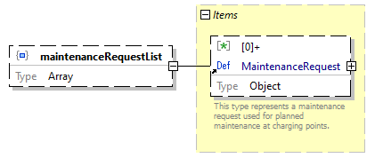</td>
				</tr>
				<tr>
					<td class="td-border" align="right" valign="top" style="width:10%;background-color:#F0F0F0;">property details</td>
					<td class="td-border" align="left" valign="top" style="width:90%;background-color:#F0F0F0;"><table class="table-no-border" cellspacing="0" cellpadding="0"><tr><td align="right" valign="top" style="background-color:#F0F0F0;">Occurrence&nbsp;&nbsp;</td><td align="left" valign="top" style="background-color:#F0F0F0;">Optional</td></tr></table></td>
				</tr>
				<tr>
					<td class="td-border" align="right" valign="top" style="width:10%;background-color:#F0F0F0;">type</td>
					<td class="td-border" align="left" valign="top" style="width:90%;background-color:#F0F0F0;">Array</td>
				</tr>
				<tr>
					<td class="td-border" align="right" valign="top" style="width:10%;background-color:#F0F0F0;">array items</td>
					<td class="td-border" align="left" valign="top" style="width:90%;background-color:#F0F0F0;"><table class="table-no-border" cellspacing="0" cellpadding="0"><tr><td align="left" valign="top" style="background-color:#F0F0F0;">[0]+&nbsp;&nbsp;</td><td align="left" valign="top" style="background-color:#F0F0F0;"><a href="#LinkA">MaintenanceRequest</a></td></tr></table></td>
				</tr>
				<tr>
					<td class="td-border" align="right" valign="top" style="width:10%;background-color:#F0F0F0;">source code</td>
					<td class="td-border" align="left" valign="top" style="width:90%;background-color:#F0F0F0;">&quot;maintenanceRequestList&quot;: { 
&nbsp;&nbsp;&nbsp; &quot;type&quot;: &quot;array&quot;, 
&nbsp;&nbsp;&nbsp; &quot;items&quot;: { 
&nbsp;&nbsp;&nbsp;&nbsp;&nbsp;&nbsp;&nbsp; &quot;$ref&quot;: &quot;#/definitions/MaintenanceRequest&quot; 
&nbsp;&nbsp;&nbsp; }, 
&nbsp;&nbsp;&nbsp; &quot;additionalProperties&quot;: false 
}</td>
				</tr>
			</table>
			 
			
			Schema definition
			VehicleIdentifier
			<table class="table-border" width="100%" cellspacing="0" cellpadding="5" border="1">
				<tr>
					<td class="td-border" align="right" valign="top" style="width:10%;background-color:#F0F0F0;">diagram</td>
					<td class="td-border" align="left" valign="top" style="width:90%;background-color:#FFFFFF;"></td>
				</tr>
				<tr>
					<td class="td-border" align="right" valign="top" style="width:10%;background-color:#F0F0F0;">schema details</td>
					<td class="td-border" align="left" valign="top" style="width:90%;background-color:#F0F0F0;"><table class="table-no-border" cellspacing="0" cellpadding="0"><tr><td align="right" valign="top" style="background-color:#F0F0F0;">Description&nbsp;&nbsp;</td><td align="left" valign="top" style="background-color:#F0F0F0;">This type represents an unique vehicle identifier associated with VDV261.</td></tr></table></td>
				</tr>
				<tr>
					<td class="td-border" align="right" valign="top" style="width:10%;background-color:#F0F0F0;">type</td>
					<td class="td-border" align="left" valign="top" style="width:90%;background-color:#F0F0F0;">String</td>
				</tr>
				<tr>
					<td class="td-border" align="right" valign="top" style="width:10%;background-color:#F0F0F0;">used by</td>
					<td class="td-border" align="left" valign="top" style="width:90%;background-color:#F0F0F0;">ChargingRequest / <a href="#LinkF">vehicleId</a> </td>
				</tr>
				<tr>
					<td class="td-border" align="right" valign="top" style="width:10%;background-color:#F0F0F0;">source code</td>
					<td class="td-border" align="left" valign="top" style="width:90%;background-color:#F0F0F0;">&quot;VehicleIdentifier&quot;: { 
&nbsp;&nbsp;&nbsp; &quot;description&quot;: &quot;This type represents an unique vehicle identifier associated with VDV261.&quot;, 
&nbsp;&nbsp;&nbsp; &quot;type&quot;: &quot;string&quot;, 
&nbsp;&nbsp;&nbsp; &quot;additionalProperties&quot;: false 
}</td>
				</tr>
			</table>
			 
			
			Schema definition
			UniqueIdentifier
			<table class="table-border" width="100%" cellspacing="0" cellpadding="5" border="1">
				<tr>
					<td class="td-border" align="right" valign="top" style="width:10%;background-color:#F0F0F0;">diagram</td>
					<td class="td-border" align="left" valign="top" style="width:90%;background-color:#FFFFFF;"></td>
				</tr>
				<tr>
					<td class="td-border" align="right" valign="top" style="width:10%;background-color:#F0F0F0;">schema details</td>
					<td class="td-border" align="left" valign="top" style="width:90%;background-color:#F0F0F0;"><table class="table-no-border" cellspacing="0" cellpadding="0"><tr><td align="right" valign="top" style="background-color:#F0F0F0;">Description&nbsp;&nbsp;</td><td align="left" valign="top" style="background-color:#F0F0F0;">This type represents an unique identifier.</td></tr></table></td>
				</tr>
				<tr>
					<td class="td-border" align="right" valign="top" style="width:10%;background-color:#F0F0F0;">type</td>
					<td class="td-border" align="left" valign="top" style="width:90%;background-color:#F0F0F0;">String</td>
				</tr>
				<tr>
					<td class="td-border" align="right" valign="top" style="width:10%;background-color:#F0F0F0;">used by</td>
					<td class="td-border" align="left" valign="top" style="width:90%;background-color:#F0F0F0;">ChargingRequest / <a href="#Link10">chargingPointId</a> ChargingRequest / <a href="#Link11">chargingRequestId</a> ChargingRequest / <a href="#Link12">chargingProcessId</a> MaintenanceRequest / <a href="#Link13">chargingPointId</a> </td>
				</tr>
				<tr>
					<td class="td-border" align="right" valign="top" style="width:10%;background-color:#F0F0F0;">source code</td>
					<td class="td-border" align="left" valign="top" style="width:90%;background-color:#F0F0F0;">&quot;UniqueIdentifier&quot;: { 
&nbsp;&nbsp;&nbsp; &quot;description&quot;: &quot;This type represents an unique identifier.&quot;, 
&nbsp;&nbsp;&nbsp; &quot;type&quot;: &quot;string&quot;, 
&nbsp;&nbsp;&nbsp; &quot;additionalProperties&quot;: false 
}</td>
				</tr>
			</table>
			 
			
			Schema definition
			ChargingInstruction
			<table class="table-border" width="100%" cellspacing="0" cellpadding="5" border="1">
				<tr>
					<td class="td-border" align="right" valign="top" style="width:10%;background-color:#F0F0F0;">diagram</td>
					<td class="td-border" align="left" valign="top" style="width:90%;background-color:#FFFFFF;">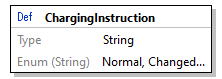</td>
				</tr>
				<tr>
					<td class="td-border" align="right" valign="top" style="width:10%;background-color:#F0F0F0;">type</td>
					<td class="td-border" align="left" valign="top" style="width:90%;background-color:#F0F0F0;">String</td>
				</tr>
				<tr>
					<td class="td-border" align="right" valign="top" style="width:10%;background-color:#F0F0F0;">enumerations</td>
					<td class="td-border" align="left" valign="top" style="width:90%;background-color:#F0F0F0;"><table class="table-no-border" cellspacing="0" cellpadding="0"><tr><td align="left" valign="top" style="background-color:#F0F0F0;">Type&nbsp;&nbsp;&nbsp;</td><td align="left" valign="top" style="background-color:#F0F0F0;">Value</td></tr><tr><td align="left" valign="top" style="background-color:#F0F0F0;">string&nbsp;&nbsp;&nbsp;</td><td align="left" valign="top" style="background-color:#F0F0F0;">Normal</td></tr><tr><td align="left" valign="top" style="background-color:#F0F0F0;">string&nbsp;&nbsp;&nbsp;</td><td align="left" valign="top" style="background-color:#F0F0F0;">Changed</td></tr><tr><td align="left" valign="top" style="background-color:#F0F0F0;">string&nbsp;&nbsp;&nbsp;</td><td align="left" valign="top" style="background-color:#F0F0F0;">Terminate</td></tr></table></td>
				</tr>
				<tr>
					<td class="td-border" align="right" valign="top" style="width:10%;background-color:#F0F0F0;">used by</td>
					<td class="td-border" align="left" valign="top" style="width:90%;background-color:#F0F0F0;">ChargingRequest / <a href="#Link14">chargingInstruction</a> </td>
				</tr>
				<tr>
					<td class="td-border" align="right" valign="top" style="width:10%;background-color:#F0F0F0;">source code</td>
					<td class="td-border" align="left" valign="top" style="width:90%;background-color:#F0F0F0;">&quot;ChargingInstruction&quot;: { 
&nbsp;&nbsp;&nbsp; &quot;type&quot;: &quot;string&quot;, 
&nbsp;&nbsp;&nbsp; &quot;additionalProperties&quot;: false, 
&nbsp;&nbsp;&nbsp; &quot;enum&quot;: [ 
&nbsp;&nbsp;&nbsp;&nbsp;&nbsp;&nbsp;&nbsp; &quot;Normal&quot;, 
&nbsp;&nbsp;&nbsp;&nbsp;&nbsp;&nbsp;&nbsp; &quot;Changed&quot;, 
&nbsp;&nbsp;&nbsp;&nbsp;&nbsp;&nbsp;&nbsp; &quot;Terminate&quot; 
&nbsp;&nbsp;&nbsp; ] 
}</td>
				</tr>
			</table>
			 
			
			Schema definition
			ChargingRequestData
			<table class="table-border" width="100%" cellspacing="0" cellpadding="5" border="1">
				<tr>
					<td class="td-border" align="right" valign="top" style="width:10%;background-color:#F0F0F0;">diagram</td>
					<td class="td-border" align="left" valign="top" style="width:90%;background-color:#FFFFFF;"><map id="Map4" name="Map4"><area alt="" coords="235,40,437,108" href="#Link15" /><area alt="" coords="235,120,400,167" href="#Link16" /><area alt="" coords="235,179,354,226" href="#Link17" /><area alt="" coords="235,238,357,285" href="#Link18" /><area alt="" coords="235,297,437,365" href="#Link19" /><area alt="" coords="235,377,361,424" href="#Link1A" /></map></td>
				</tr>
				<tr>
					<td class="td-border" align="right" valign="top" style="width:10%;background-color:#F0F0F0;">type</td>
					<td class="td-border" align="left" valign="top" style="width:90%;background-color:#F0F0F0;">Object</td>
				</tr>
				<tr>
					<td class="td-border" align="right" valign="top" style="width:10%;background-color:#F0F0F0;">properties</td>
					<td class="td-border" align="left" valign="top" style="width:90%;background-color:#F0F0F0;"><table class="table-no-border" cellspacing="0" cellpadding="0"><tr><td align="left" valign="top" style="background-color:#F0F0F0;">Name&nbsp;&nbsp;&nbsp;</td><td align="left" valign="top" style="background-color:#F0F0F0;">Occurrence</td></tr><tr><td align="left" valign="top" style="background-color:#F0F0F0;"><a href="#Link15">expectedArrivalTimeAtChargingPoint</a>&nbsp;&nbsp;&nbsp;</td><td align="left" valign="top" style="background-color:#F0F0F0;">Optional</td></tr><tr><td align="left" valign="top" style="background-color:#F0F0F0;"><a href="#Link16">expectedSocAtArrival</a>&nbsp;&nbsp;&nbsp;</td><td align="left" valign="top" style="background-color:#F0F0F0;">Optional</td></tr><tr><td align="left" valign="top" style="background-color:#F0F0F0;"><a href="#Link17">minTargetSoc</a>&nbsp;&nbsp;&nbsp;</td><td align="left" valign="top" style="background-color:#F0F0F0;">Required</td></tr><tr><td align="left" valign="top" style="background-color:#F0F0F0;"><a href="#Link18">maxTargetSoc</a>&nbsp;&nbsp;&nbsp;</td><td align="left" valign="top" style="background-color:#F0F0F0;">Required</td></tr><tr><td align="left" valign="top" style="background-color:#F0F0F0;"><a href="#Link19">requestedTimeForDeparture</a>&nbsp;&nbsp;&nbsp;</td><td align="left" valign="top" style="background-color:#F0F0F0;">Optional</td></tr><tr><td align="left" valign="top" style="background-color:#F0F0F0;"><a href="#Link1A">adHocCharging</a>&nbsp;&nbsp;&nbsp;</td><td align="left" valign="top" style="background-color:#F0F0F0;">Optional</td></tr></table></td>
				</tr>
				<tr>
					<td class="td-border" align="right" valign="top" style="width:10%;background-color:#F0F0F0;">used by</td>
					<td class="td-border" align="left" valign="top" style="width:90%;background-color:#F0F0F0;">ChargingRequest / <a href="#Link1B">chargingRequestData</a> </td>
				</tr>
				<tr>
					<td class="td-border" align="right" valign="top" style="width:10%;background-color:#F0F0F0;">source code</td>
					<td class="td-border" align="left" valign="top" style="width:90%;background-color:#F0F0F0;">&quot;ChargingRequestData&quot;: { 
&nbsp;&nbsp;&nbsp; &quot;type&quot;: &quot;object&quot;, 
&nbsp;&nbsp;&nbsp; &quot;properties&quot;: { 
&nbsp;&nbsp;&nbsp;&nbsp;&nbsp;&nbsp;&nbsp; &quot;expectedArrivalTimeAtChargingPoint&quot;: { 
&nbsp;&nbsp;&nbsp;&nbsp;&nbsp;&nbsp;&nbsp;&nbsp;&nbsp;&nbsp;&nbsp; &quot;type&quot;: &quot;string&quot;, 
&nbsp;&nbsp;&nbsp;&nbsp;&nbsp;&nbsp;&nbsp;&nbsp;&nbsp;&nbsp;&nbsp; &quot;format&quot;: &quot;date-time&quot;, 
&nbsp;&nbsp;&nbsp;&nbsp;&nbsp;&nbsp;&nbsp;&nbsp;&nbsp;&nbsp;&nbsp; &quot;additionalProperties&quot;: false 
&nbsp;&nbsp;&nbsp;&nbsp;&nbsp;&nbsp;&nbsp; }, 
&nbsp;&nbsp;&nbsp;&nbsp;&nbsp;&nbsp;&nbsp; &quot;expectedSocAtArrival&quot;: { 
&nbsp;&nbsp;&nbsp;&nbsp;&nbsp;&nbsp;&nbsp;&nbsp;&nbsp;&nbsp;&nbsp; &quot;type&quot;: &quot;number&quot;, 
&nbsp;&nbsp;&nbsp;&nbsp;&nbsp;&nbsp;&nbsp;&nbsp;&nbsp;&nbsp;&nbsp; &quot;additionalProperties&quot;: false 
&nbsp;&nbsp;&nbsp;&nbsp;&nbsp;&nbsp;&nbsp; }, 
&nbsp;&nbsp;&nbsp;&nbsp;&nbsp;&nbsp;&nbsp; &quot;minTargetSoc&quot;: { 
&nbsp;&nbsp;&nbsp;&nbsp;&nbsp;&nbsp;&nbsp;&nbsp;&nbsp;&nbsp;&nbsp; &quot;type&quot;: &quot;number&quot;, 
&nbsp;&nbsp;&nbsp;&nbsp;&nbsp;&nbsp;&nbsp;&nbsp;&nbsp;&nbsp;&nbsp; &quot;additionalProperties&quot;: false 
&nbsp;&nbsp;&nbsp;&nbsp;&nbsp;&nbsp;&nbsp; }, 
&nbsp;&nbsp;&nbsp;&nbsp;&nbsp;&nbsp;&nbsp; &quot;maxTargetSoc&quot;: { 
&nbsp;&nbsp;&nbsp;&nbsp;&nbsp;&nbsp;&nbsp;&nbsp;&nbsp;&nbsp;&nbsp; &quot;type&quot;: &quot;number&quot;, 
&nbsp;&nbsp;&nbsp;&nbsp;&nbsp;&nbsp;&nbsp;&nbsp;&nbsp;&nbsp;&nbsp; &quot;additionalProperties&quot;: false 
&nbsp;&nbsp;&nbsp;&nbsp;&nbsp;&nbsp;&nbsp; }, 
&nbsp;&nbsp;&nbsp;&nbsp;&nbsp;&nbsp;&nbsp; &quot;requestedTimeForDeparture&quot;: { 
&nbsp;&nbsp;&nbsp;&nbsp;&nbsp;&nbsp;&nbsp;&nbsp;&nbsp;&nbsp;&nbsp; &quot;type&quot;: &quot;string&quot;, 
&nbsp;&nbsp;&nbsp;&nbsp;&nbsp;&nbsp;&nbsp;&nbsp;&nbsp;&nbsp;&nbsp; &quot;format&quot;: &quot;date-time&quot;, 
&nbsp;&nbsp;&nbsp;&nbsp;&nbsp;&nbsp;&nbsp;&nbsp;&nbsp;&nbsp;&nbsp; &quot;additionalProperties&quot;: false 
&nbsp;&nbsp;&nbsp;&nbsp;&nbsp;&nbsp;&nbsp; }, 
&nbsp;&nbsp;&nbsp;&nbsp;&nbsp;&nbsp;&nbsp; &quot;adHocCharging&quot;: { 
&nbsp;&nbsp;&nbsp;&nbsp;&nbsp;&nbsp;&nbsp;&nbsp;&nbsp;&nbsp;&nbsp; &quot;type&quot;: &quot;boolean&quot;, 
&nbsp;&nbsp;&nbsp;&nbsp;&nbsp;&nbsp;&nbsp;&nbsp;&nbsp;&nbsp;&nbsp; &quot;additionalProperties&quot;: false 
&nbsp;&nbsp;&nbsp;&nbsp;&nbsp;&nbsp;&nbsp; } 
&nbsp;&nbsp;&nbsp; }, 
&nbsp;&nbsp;&nbsp; &quot;required&quot;: [ 
&nbsp;&nbsp;&nbsp;&nbsp;&nbsp;&nbsp;&nbsp; &quot;minTargetSoc&quot;, 
&nbsp;&nbsp;&nbsp;&nbsp;&nbsp;&nbsp;&nbsp; &quot;maxTargetSoc&quot; 
&nbsp;&nbsp;&nbsp; ], 
&nbsp;&nbsp;&nbsp; &quot;additionalProperties&quot;: false 
}</td>
				</tr>
			</table>
			 
			
			Property
			<a href="#Link5">
				ChargingRequestData
			</a>
			 / 
			expectedArrivalTimeAtChargingPoint
			<table class="table-border" width="100%" cellspacing="0" cellpadding="5" border="1">
				<tr>
					<td class="td-border" align="right" valign="top" style="width:10%;background-color:#F0F0F0;">diagram</td>
					<td class="td-border" align="left" valign="top" style="width:90%;background-color:#FFFFFF;"></td>
				</tr>
				<tr>
					<td class="td-border" align="right" valign="top" style="width:10%;background-color:#F0F0F0;">property details</td>
					<td class="td-border" align="left" valign="top" style="width:90%;background-color:#F0F0F0;"><table class="table-no-border" cellspacing="0" cellpadding="0"><tr><td align="right" valign="top" style="background-color:#F0F0F0;">Occurrence&nbsp;&nbsp;</td><td align="left" valign="top" style="background-color:#F0F0F0;">Optional</td></tr></table></td>
				</tr>
				<tr>
					<td class="td-border" align="right" valign="top" style="width:10%;background-color:#F0F0F0;">type</td>
					<td class="td-border" align="left" valign="top" style="width:90%;background-color:#F0F0F0;">String</td>
				</tr>
				<tr>
					<td class="td-border" align="right" valign="top" style="width:10%;background-color:#F0F0F0;">string constraints</td>
					<td class="td-border" align="left" valign="top" style="width:90%;background-color:#F0F0F0;"><table class="table-no-border" cellspacing="0" cellpadding="0"><tr><td align="right" valign="top" style="background-color:#F0F0F0;">Format&nbsp;&nbsp;</td><td align="left" valign="top" style="background-color:#F0F0F0;">date-time</td></tr></table></td>
				</tr>
				<tr>
					<td class="td-border" align="right" valign="top" style="width:10%;background-color:#F0F0F0;">source code</td>
					<td class="td-border" align="left" valign="top" style="width:90%;background-color:#F0F0F0;">&quot;expectedArrivalTimeAtChargingPoint&quot;: { 
&nbsp;&nbsp;&nbsp; &quot;type&quot;: &quot;string&quot;, 
&nbsp;&nbsp;&nbsp; &quot;format&quot;: &quot;date-time&quot;, 
&nbsp;&nbsp;&nbsp; &quot;additionalProperties&quot;: false 
}</td>
				</tr>
			</table>
			 
			
			Property
			<a href="#Link5">
				ChargingRequestData
			</a>
			 / 
			expectedSocAtArrival
			<table class="table-border" width="100%" cellspacing="0" cellpadding="5" border="1">
				<tr>
					<td class="td-border" align="right" valign="top" style="width:10%;background-color:#F0F0F0;">diagram</td>
					<td class="td-border" align="left" valign="top" style="width:90%;background-color:#FFFFFF;">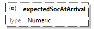</td>
				</tr>
				<tr>
					<td class="td-border" align="right" valign="top" style="width:10%;background-color:#F0F0F0;">property details</td>
					<td class="td-border" align="left" valign="top" style="width:90%;background-color:#F0F0F0;"><table class="table-no-border" cellspacing="0" cellpadding="0"><tr><td align="right" valign="top" style="background-color:#F0F0F0;">Occurrence&nbsp;&nbsp;</td><td align="left" valign="top" style="background-color:#F0F0F0;">Optional</td></tr></table></td>
				</tr>
				<tr>
					<td class="td-border" align="right" valign="top" style="width:10%;background-color:#F0F0F0;">type</td>
					<td class="td-border" align="left" valign="top" style="width:90%;background-color:#F0F0F0;">Numeric</td>
				</tr>
				<tr>
					<td class="td-border" align="right" valign="top" style="width:10%;background-color:#F0F0F0;">source code</td>
					<td class="td-border" align="left" valign="top" style="width:90%;background-color:#F0F0F0;">&quot;expectedSocAtArrival&quot;: { 
&nbsp;&nbsp;&nbsp; &quot;type&quot;: &quot;number&quot;, 
&nbsp;&nbsp;&nbsp; &quot;additionalProperties&quot;: false 
}</td>
				</tr>
			</table>
			 
			
			Property
			<a href="#Link5">
				ChargingRequestData
			</a>
			 / 
			minTargetSoc
			<table class="table-border" width="100%" cellspacing="0" cellpadding="5" border="1">
				<tr>
					<td class="td-border" align="right" valign="top" style="width:10%;background-color:#F0F0F0;">diagram</td>
					<td class="td-border" align="left" valign="top" style="width:90%;background-color:#FFFFFF;">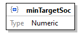</td>
				</tr>
				<tr>
					<td class="td-border" align="right" valign="top" style="width:10%;background-color:#F0F0F0;">property details</td>
					<td class="td-border" align="left" valign="top" style="width:90%;background-color:#F0F0F0;"><table class="table-no-border" cellspacing="0" cellpadding="0"><tr><td align="right" valign="top" style="background-color:#F0F0F0;">Occurrence&nbsp;&nbsp;</td><td align="left" valign="top" style="background-color:#F0F0F0;">Required</td></tr></table></td>
				</tr>
				<tr>
					<td class="td-border" align="right" valign="top" style="width:10%;background-color:#F0F0F0;">type</td>
					<td class="td-border" align="left" valign="top" style="width:90%;background-color:#F0F0F0;">Numeric</td>
				</tr>
				<tr>
					<td class="td-border" align="right" valign="top" style="width:10%;background-color:#F0F0F0;">source code</td>
					<td class="td-border" align="left" valign="top" style="width:90%;background-color:#F0F0F0;">&quot;minTargetSoc&quot;: { 
&nbsp;&nbsp;&nbsp; &quot;type&quot;: &quot;number&quot;, 
&nbsp;&nbsp;&nbsp; &quot;additionalProperties&quot;: false 
}</td>
				</tr>
			</table>
			 
			
			Property
			<a href="#Link5">
				ChargingRequestData
			</a>
			 / 
			maxTargetSoc
			<table class="table-border" width="100%" cellspacing="0" cellpadding="5" border="1">
				<tr>
					<td class="td-border" align="right" valign="top" style="width:10%;background-color:#F0F0F0;">diagram</td>
					<td class="td-border" align="left" valign="top" style="width:90%;background-color:#FFFFFF;"></td>
				</tr>
				<tr>
					<td class="td-border" align="right" valign="top" style="width:10%;background-color:#F0F0F0;">property details</td>
					<td class="td-border" align="left" valign="top" style="width:90%;background-color:#F0F0F0;"><table class="table-no-border" cellspacing="0" cellpadding="0"><tr><td align="right" valign="top" style="background-color:#F0F0F0;">Occurrence&nbsp;&nbsp;</td><td align="left" valign="top" style="background-color:#F0F0F0;">Required</td></tr></table></td>
				</tr>
				<tr>
					<td class="td-border" align="right" valign="top" style="width:10%;background-color:#F0F0F0;">type</td>
					<td class="td-border" align="left" valign="top" style="width:90%;background-color:#F0F0F0;">Numeric</td>
				</tr>
				<tr>
					<td class="td-border" align="right" valign="top" style="width:10%;background-color:#F0F0F0;">source code</td>
					<td class="td-border" align="left" valign="top" style="width:90%;background-color:#F0F0F0;">&quot;maxTargetSoc&quot;: { 
&nbsp;&nbsp;&nbsp; &quot;type&quot;: &quot;number&quot;, 
&nbsp;&nbsp;&nbsp; &quot;additionalProperties&quot;: false 
}</td>
				</tr>
			</table>
			 
			
			Property
			<a href="#Link5">
				ChargingRequestData
			</a>
			 / 
			requestedTimeForDeparture
			<table class="table-border" width="100%" cellspacing="0" cellpadding="5" border="1">
				<tr>
					<td class="td-border" align="right" valign="top" style="width:10%;background-color:#F0F0F0;">diagram</td>
					<td class="td-border" align="left" valign="top" style="width:90%;background-color:#FFFFFF;"></td>
				</tr>
				<tr>
					<td class="td-border" align="right" valign="top" style="width:10%;background-color:#F0F0F0;">property details</td>
					<td class="td-border" align="left" valign="top" style="width:90%;background-color:#F0F0F0;"><table class="table-no-border" cellspacing="0" cellpadding="0"><tr><td align="right" valign="top" style="background-color:#F0F0F0;">Occurrence&nbsp;&nbsp;</td><td align="left" valign="top" style="background-color:#F0F0F0;">Optional</td></tr></table></td>
				</tr>
				<tr>
					<td class="td-border" align="right" valign="top" style="width:10%;background-color:#F0F0F0;">type</td>
					<td class="td-border" align="left" valign="top" style="width:90%;background-color:#F0F0F0;">String</td>
				</tr>
				<tr>
					<td class="td-border" align="right" valign="top" style="width:10%;background-color:#F0F0F0;">string constraints</td>
					<td class="td-border" align="left" valign="top" style="width:90%;background-color:#F0F0F0;"><table class="table-no-border" cellspacing="0" cellpadding="0"><tr><td align="right" valign="top" style="background-color:#F0F0F0;">Format&nbsp;&nbsp;</td><td align="left" valign="top" style="background-color:#F0F0F0;">date-time</td></tr></table></td>
				</tr>
				<tr>
					<td class="td-border" align="right" valign="top" style="width:10%;background-color:#F0F0F0;">source code</td>
					<td class="td-border" align="left" valign="top" style="width:90%;background-color:#F0F0F0;">&quot;requestedTimeForDeparture&quot;: { 
&nbsp;&nbsp;&nbsp; &quot;type&quot;: &quot;string&quot;, 
&nbsp;&nbsp;&nbsp; &quot;format&quot;: &quot;date-time&quot;, 
&nbsp;&nbsp;&nbsp; &quot;additionalProperties&quot;: false 
}</td>
				</tr>
			</table>
			 
			
			Property
			<a href="#Link5">
				ChargingRequestData
			</a>
			 / 
			adHocCharging
			<table class="table-border" width="100%" cellspacing="0" cellpadding="5" border="1">
				<tr>
					<td class="td-border" align="right" valign="top" style="width:10%;background-color:#F0F0F0;">diagram</td>
					<td class="td-border" align="left" valign="top" style="width:90%;background-color:#FFFFFF;">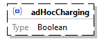</td>
				</tr>
				<tr>
					<td class="td-border" align="right" valign="top" style="width:10%;background-color:#F0F0F0;">property details</td>
					<td class="td-border" align="left" valign="top" style="width:90%;background-color:#F0F0F0;"><table class="table-no-border" cellspacing="0" cellpadding="0"><tr><td align="right" valign="top" style="background-color:#F0F0F0;">Occurrence&nbsp;&nbsp;</td><td align="left" valign="top" style="background-color:#F0F0F0;">Optional</td></tr></table></td>
				</tr>
				<tr>
					<td class="td-border" align="right" valign="top" style="width:10%;background-color:#F0F0F0;">type</td>
					<td class="td-border" align="left" valign="top" style="width:90%;background-color:#F0F0F0;">Boolean</td>
				</tr>
				<tr>
					<td class="td-border" align="right" valign="top" style="width:10%;background-color:#F0F0F0;">source code</td>
					<td class="td-border" align="left" valign="top" style="width:90%;background-color:#F0F0F0;">&quot;adHocCharging&quot;: { 
&nbsp;&nbsp;&nbsp; &quot;type&quot;: &quot;boolean&quot;, 
&nbsp;&nbsp;&nbsp; &quot;additionalProperties&quot;: false 
}</td>
				</tr>
			</table>
			 
			
			Schema definition
			PreconditioningRequest
			<table class="table-border" width="100%" cellspacing="0" cellpadding="5" border="1">
				<tr>
					<td class="td-border" align="right" valign="top" style="width:10%;background-color:#F0F0F0;">diagram</td>
					<td class="td-border" align="left" valign="top" style="width:90%;background-color:#FFFFFF;"></td>
				</tr>
				<tr>
					<td class="td-border" align="right" valign="top" style="width:10%;background-color:#F0F0F0;">type</td>
					<td class="td-border" align="left" valign="top" style="width:90%;background-color:#F0F0F0;">String</td>
				</tr>
				<tr>
					<td class="td-border" align="right" valign="top" style="width:10%;background-color:#F0F0F0;">enumerations</td>
					<td class="td-border" align="left" valign="top" style="width:90%;background-color:#F0F0F0;"><table class="table-no-border" cellspacing="0" cellpadding="0"><tr><td align="left" valign="top" style="background-color:#F0F0F0;">Type&nbsp;&nbsp;&nbsp;</td><td align="left" valign="top" style="background-color:#F0F0F0;">Value</td></tr><tr><td align="left" valign="top" style="background-color:#F0F0F0;">string&nbsp;&nbsp;&nbsp;</td><td align="left" valign="top" style="background-color:#F0F0F0;">WarmWaterAndVentilation</td></tr><tr><td align="left" valign="top" style="background-color:#F0F0F0;">string&nbsp;&nbsp;&nbsp;</td><td align="left" valign="top" style="background-color:#F0F0F0;">HotWaterAndHeating</td></tr><tr><td align="left" valign="top" style="background-color:#F0F0F0;">string&nbsp;&nbsp;&nbsp;</td><td align="left" valign="top" style="background-color:#F0F0F0;">NoWaterCoolingOrVentilation</td></tr><tr><td align="left" valign="top" style="background-color:#F0F0F0;">string&nbsp;&nbsp;&nbsp;</td><td align="left" valign="top" style="background-color:#F0F0F0;">NoClimaticPreconditioningOrSNA</td></tr></table></td>
				</tr>
				<tr>
					<td class="td-border" align="right" valign="top" style="width:10%;background-color:#F0F0F0;">used by</td>
					<td class="td-border" align="left" valign="top" style="width:90%;background-color:#F0F0F0;">AutomaticPreconditioning / <a href="#Link1C">preconditioningRequest</a> </td>
				</tr>
				<tr>
					<td class="td-border" align="right" valign="top" style="width:10%;background-color:#F0F0F0;">source code</td>
					<td class="td-border" align="left" valign="top" style="width:90%;background-color:#F0F0F0;">&quot;PreconditioningRequest&quot;: { 
&nbsp;&nbsp;&nbsp; &quot;type&quot;: &quot;string&quot;, 
&nbsp;&nbsp;&nbsp; &quot;additionalProperties&quot;: false, 
&nbsp;&nbsp;&nbsp; &quot;enum&quot;: [ 
&nbsp;&nbsp;&nbsp;&nbsp;&nbsp;&nbsp;&nbsp; &quot;WarmWaterAndVentilation&quot;, 
&nbsp;&nbsp;&nbsp;&nbsp;&nbsp;&nbsp;&nbsp; &quot;HotWaterAndHeating&quot;, 
&nbsp;&nbsp;&nbsp;&nbsp;&nbsp;&nbsp;&nbsp; &quot;NoWaterCoolingOrVentilation&quot;, 
&nbsp;&nbsp;&nbsp;&nbsp;&nbsp;&nbsp;&nbsp; &quot;NoClimaticPreconditioningOrSNA&quot; 
&nbsp;&nbsp;&nbsp; ] 
}</td>
				</tr>
			</table>
			 
			
			Schema definition
			AutomaticPreconditioning
			<table class="table-border" width="100%" cellspacing="0" cellpadding="5" border="1">
				<tr>
					<td class="td-border" align="right" valign="top" style="width:10%;background-color:#F0F0F0;">diagram</td>
					<td class="td-border" align="left" valign="top" style="width:90%;background-color:#FFFFFF;"><map id="Map5" name="Map5"><area alt="" coords="260,40,462,130" href="#Link1C" /><area alt="" coords="260,142,421,189" href="#Link1D" /><area alt="" coords="260,201,440,269" href="#Link1E" /><area alt="" coords="260,281,440,349" href="#Link1F" /></map></td>
				</tr>
				<tr>
					<td class="td-border" align="right" valign="top" style="width:10%;background-color:#F0F0F0;">schema details</td>
					<td class="td-border" align="left" valign="top" style="width:90%;background-color:#F0F0F0;"><table class="table-no-border" cellspacing="0" cellpadding="0"><tr><td align="right" valign="top" style="background-color:#F0F0F0;">Description&nbsp;&nbsp;</td><td align="left" valign="top" style="background-color:#F0F0F0;">This type imposes properties regarding automatic preconditioning.</td></tr></table></td>
				</tr>
				<tr>
					<td class="td-border" align="right" valign="top" style="width:10%;background-color:#F0F0F0;">type</td>
					<td class="td-border" align="left" valign="top" style="width:90%;background-color:#F0F0F0;">Object</td>
				</tr>
				<tr>
					<td class="td-border" align="right" valign="top" style="width:10%;background-color:#F0F0F0;">properties</td>
					<td class="td-border" align="left" valign="top" style="width:90%;background-color:#F0F0F0;"><table class="table-no-border" cellspacing="0" cellpadding="0"><tr><td align="left" valign="top" style="background-color:#F0F0F0;">Name&nbsp;&nbsp;&nbsp;</td><td align="left" valign="top" style="background-color:#F0F0F0;">Occurrence</td></tr><tr><td align="left" valign="top" style="background-color:#F0F0F0;"><a href="#Link1C">preconditioningRequest</a>&nbsp;&nbsp;&nbsp;</td><td align="left" valign="top" style="background-color:#F0F0F0;">Required</td></tr><tr><td align="left" valign="top" style="background-color:#F0F0F0;"><a href="#Link1D">ambientTemperature</a>&nbsp;&nbsp;&nbsp;</td><td align="left" valign="top" style="background-color:#F0F0F0;">Optional</td></tr><tr><td align="left" valign="top" style="background-color:#F0F0F0;"><a href="#Link1E">requestedStartTime</a>&nbsp;&nbsp;&nbsp;</td><td align="left" valign="top" style="background-color:#F0F0F0;">Optional</td></tr><tr><td align="left" valign="top" style="background-color:#F0F0F0;"><a href="#Link1F">requestedFinishTime</a>&nbsp;&nbsp;&nbsp;</td><td align="left" valign="top" style="background-color:#F0F0F0;">Optional</td></tr></table></td>
				</tr>
				<tr>
					<td class="td-border" align="right" valign="top" style="width:10%;background-color:#F0F0F0;">used by</td>
					<td class="td-border" align="left" valign="top" style="width:90%;background-color:#F0F0F0;">ChargingRequest / <a href="#Link20">automaticPreconditioning</a> </td>
				</tr>
				<tr>
					<td class="td-border" align="right" valign="top" style="width:10%;background-color:#F0F0F0;">source code</td>
					<td class="td-border" align="left" valign="top" style="width:90%;background-color:#F0F0F0;">&quot;AutomaticPreconditioning&quot;: { 
&nbsp;&nbsp;&nbsp; &quot;description&quot;: &quot;This type imposes properties regarding automatic preconditioning.&quot;, 
&nbsp;&nbsp;&nbsp; &quot;type&quot;: &quot;object&quot;, 
&nbsp;&nbsp;&nbsp; &quot;properties&quot;: { 
&nbsp;&nbsp;&nbsp;&nbsp;&nbsp;&nbsp;&nbsp; &quot;preconditioningRequest&quot;: { 
&nbsp;&nbsp;&nbsp;&nbsp;&nbsp;&nbsp;&nbsp;&nbsp;&nbsp;&nbsp;&nbsp; &quot;$ref&quot;: &quot;#/definitions/PreconditioningRequest&quot; 
&nbsp;&nbsp;&nbsp;&nbsp;&nbsp;&nbsp;&nbsp; }, 
&nbsp;&nbsp;&nbsp;&nbsp;&nbsp;&nbsp;&nbsp; &quot;ambientTemperature&quot;: { 
&nbsp;&nbsp;&nbsp;&nbsp;&nbsp;&nbsp;&nbsp;&nbsp;&nbsp;&nbsp;&nbsp; &quot;type&quot;: &quot;number&quot;, 
&nbsp;&nbsp;&nbsp;&nbsp;&nbsp;&nbsp;&nbsp;&nbsp;&nbsp;&nbsp;&nbsp; &quot;additionalProperties&quot;: false 
&nbsp;&nbsp;&nbsp;&nbsp;&nbsp;&nbsp;&nbsp; }, 
&nbsp;&nbsp;&nbsp;&nbsp;&nbsp;&nbsp;&nbsp; &quot;requestedStartTime&quot;: { 
&nbsp;&nbsp;&nbsp;&nbsp;&nbsp;&nbsp;&nbsp;&nbsp;&nbsp;&nbsp;&nbsp; &quot;type&quot;: &quot;string&quot;, 
&nbsp;&nbsp;&nbsp;&nbsp;&nbsp;&nbsp;&nbsp;&nbsp;&nbsp;&nbsp;&nbsp; &quot;format&quot;: &quot;date-time&quot;, 
&nbsp;&nbsp;&nbsp;&nbsp;&nbsp;&nbsp;&nbsp;&nbsp;&nbsp;&nbsp;&nbsp; &quot;additionalProperties&quot;: false 
&nbsp;&nbsp;&nbsp;&nbsp;&nbsp;&nbsp;&nbsp; }, 
&nbsp;&nbsp;&nbsp;&nbsp;&nbsp;&nbsp;&nbsp; &quot;requestedFinishTime&quot;: { 
&nbsp;&nbsp;&nbsp;&nbsp;&nbsp;&nbsp;&nbsp;&nbsp;&nbsp;&nbsp;&nbsp; &quot;type&quot;: &quot;string&quot;, 
&nbsp;&nbsp;&nbsp;&nbsp;&nbsp;&nbsp;&nbsp;&nbsp;&nbsp;&nbsp;&nbsp; &quot;format&quot;: &quot;date-time&quot;, 
&nbsp;&nbsp;&nbsp;&nbsp;&nbsp;&nbsp;&nbsp;&nbsp;&nbsp;&nbsp;&nbsp; &quot;additionalProperties&quot;: false 
&nbsp;&nbsp;&nbsp;&nbsp;&nbsp;&nbsp;&nbsp; } 
&nbsp;&nbsp;&nbsp; }, 
&nbsp;&nbsp;&nbsp; &quot;required&quot;: [ 
&nbsp;&nbsp;&nbsp;&nbsp;&nbsp;&nbsp;&nbsp; &quot;preconditioningRequest&quot; 
&nbsp;&nbsp;&nbsp; ], 
&nbsp;&nbsp;&nbsp; &quot;additionalProperties&quot;: false 
}</td>
				</tr>
			</table>
			 
			
			Property
			<a href="#Link7">
				AutomaticPreconditioning
			</a>
			 / 
			preconditioningRequest
			<table class="table-border" width="100%" cellspacing="0" cellpadding="5" border="1">
				<tr>
					<td class="td-border" align="right" valign="top" style="width:10%;background-color:#F0F0F0;">diagram</td>
					<td class="td-border" align="left" valign="top" style="width:90%;background-color:#FFFFFF;"></td>
				</tr>
				<tr>
					<td class="td-border" align="right" valign="top" style="width:10%;background-color:#F0F0F0;">property details</td>
					<td class="td-border" align="left" valign="top" style="width:90%;background-color:#F0F0F0;"><table class="table-no-border" cellspacing="0" cellpadding="0"><tr><td align="right" valign="top" style="background-color:#F0F0F0;">Occurrence&nbsp;&nbsp;</td><td align="left" valign="top" style="background-color:#F0F0F0;">Required</td></tr></table></td>
				</tr>
				<tr>
					<td class="td-border" align="right" valign="top" style="width:10%;background-color:#F0F0F0;">reference</td>
					<td class="td-border" align="left" valign="top" style="width:90%;background-color:#F0F0F0;"><a href="#Link6">PreconditioningRequest</a></td>
				</tr>
				<tr>
					<td class="td-border" align="right" valign="top" style="width:10%;background-color:#F0F0F0;">source code</td>
					<td class="td-border" align="left" valign="top" style="width:90%;background-color:#F0F0F0;">&quot;preconditioningRequest&quot;: { 
&nbsp;&nbsp;&nbsp; &quot;$ref&quot;: &quot;#/definitions/PreconditioningRequest&quot; 
}</td>
				</tr>
			</table>
			 
			
			Property
			<a href="#Link7">
				AutomaticPreconditioning
			</a>
			 / 
			ambientTemperature
			<table class="table-border" width="100%" cellspacing="0" cellpadding="5" border="1">
				<tr>
					<td class="td-border" align="right" valign="top" style="width:10%;background-color:#F0F0F0;">diagram</td>
					<td class="td-border" align="left" valign="top" style="width:90%;background-color:#FFFFFF;">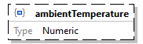</td>
				</tr>
				<tr>
					<td class="td-border" align="right" valign="top" style="width:10%;background-color:#F0F0F0;">property details</td>
					<td class="td-border" align="left" valign="top" style="width:90%;background-color:#F0F0F0;"><table class="table-no-border" cellspacing="0" cellpadding="0"><tr><td align="right" valign="top" style="background-color:#F0F0F0;">Occurrence&nbsp;&nbsp;</td><td align="left" valign="top" style="background-color:#F0F0F0;">Optional</td></tr></table></td>
				</tr>
				<tr>
					<td class="td-border" align="right" valign="top" style="width:10%;background-color:#F0F0F0;">type</td>
					<td class="td-border" align="left" valign="top" style="width:90%;background-color:#F0F0F0;">Numeric</td>
				</tr>
				<tr>
					<td class="td-border" align="right" valign="top" style="width:10%;background-color:#F0F0F0;">source code</td>
					<td class="td-border" align="left" valign="top" style="width:90%;background-color:#F0F0F0;">&quot;ambientTemperature&quot;: { 
&nbsp;&nbsp;&nbsp; &quot;type&quot;: &quot;number&quot;, 
&nbsp;&nbsp;&nbsp; &quot;additionalProperties&quot;: false 
}</td>
				</tr>
			</table>
			 
			
			Property
			<a href="#Link7">
				AutomaticPreconditioning
			</a>
			 / 
			requestedStartTime
			<table class="table-border" width="100%" cellspacing="0" cellpadding="5" border="1">
				<tr>
					<td class="td-border" align="right" valign="top" style="width:10%;background-color:#F0F0F0;">diagram</td>
					<td class="td-border" align="left" valign="top" style="width:90%;background-color:#FFFFFF;">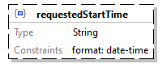</td>
				</tr>
				<tr>
					<td class="td-border" align="right" valign="top" style="width:10%;background-color:#F0F0F0;">property details</td>
					<td class="td-border" align="left" valign="top" style="width:90%;background-color:#F0F0F0;"><table class="table-no-border" cellspacing="0" cellpadding="0"><tr><td align="right" valign="top" style="background-color:#F0F0F0;">Occurrence&nbsp;&nbsp;</td><td align="left" valign="top" style="background-color:#F0F0F0;">Optional</td></tr></table></td>
				</tr>
				<tr>
					<td class="td-border" align="right" valign="top" style="width:10%;background-color:#F0F0F0;">type</td>
					<td class="td-border" align="left" valign="top" style="width:90%;background-color:#F0F0F0;">String</td>
				</tr>
				<tr>
					<td class="td-border" align="right" valign="top" style="width:10%;background-color:#F0F0F0;">string constraints</td>
					<td class="td-border" align="left" valign="top" style="width:90%;background-color:#F0F0F0;"><table class="table-no-border" cellspacing="0" cellpadding="0"><tr><td align="right" valign="top" style="background-color:#F0F0F0;">Format&nbsp;&nbsp;</td><td align="left" valign="top" style="background-color:#F0F0F0;">date-time</td></tr></table></td>
				</tr>
				<tr>
					<td class="td-border" align="right" valign="top" style="width:10%;background-color:#F0F0F0;">source code</td>
					<td class="td-border" align="left" valign="top" style="width:90%;background-color:#F0F0F0;">&quot;requestedStartTime&quot;: { 
&nbsp;&nbsp;&nbsp; &quot;type&quot;: &quot;string&quot;, 
&nbsp;&nbsp;&nbsp; &quot;format&quot;: &quot;date-time&quot;, 
&nbsp;&nbsp;&nbsp; &quot;additionalProperties&quot;: false 
}</td>
				</tr>
			</table>
			 
			
			Property
			<a href="#Link7">
				AutomaticPreconditioning
			</a>
			 / 
			requestedFinishTime
			<table class="table-border" width="100%" cellspacing="0" cellpadding="5" border="1">
				<tr>
					<td class="td-border" align="right" valign="top" style="width:10%;background-color:#F0F0F0;">diagram</td>
					<td class="td-border" align="left" valign="top" style="width:90%;background-color:#FFFFFF;">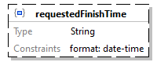</td>
				</tr>
				<tr>
					<td class="td-border" align="right" valign="top" style="width:10%;background-color:#F0F0F0;">property details</td>
					<td class="td-border" align="left" valign="top" style="width:90%;background-color:#F0F0F0;"><table class="table-no-border" cellspacing="0" cellpadding="0"><tr><td align="right" valign="top" style="background-color:#F0F0F0;">Occurrence&nbsp;&nbsp;</td><td align="left" valign="top" style="background-color:#F0F0F0;">Optional</td></tr></table></td>
				</tr>
				<tr>
					<td class="td-border" align="right" valign="top" style="width:10%;background-color:#F0F0F0;">type</td>
					<td class="td-border" align="left" valign="top" style="width:90%;background-color:#F0F0F0;">String</td>
				</tr>
				<tr>
					<td class="td-border" align="right" valign="top" style="width:10%;background-color:#F0F0F0;">string constraints</td>
					<td class="td-border" align="left" valign="top" style="width:90%;background-color:#F0F0F0;"><table class="table-no-border" cellspacing="0" cellpadding="0"><tr><td align="right" valign="top" style="background-color:#F0F0F0;">Format&nbsp;&nbsp;</td><td align="left" valign="top" style="background-color:#F0F0F0;">date-time</td></tr></table></td>
				</tr>
				<tr>
					<td class="td-border" align="right" valign="top" style="width:10%;background-color:#F0F0F0;">source code</td>
					<td class="td-border" align="left" valign="top" style="width:90%;background-color:#F0F0F0;">&quot;requestedFinishTime&quot;: { 
&nbsp;&nbsp;&nbsp; &quot;type&quot;: &quot;string&quot;, 
&nbsp;&nbsp;&nbsp; &quot;format&quot;: &quot;date-time&quot;, 
&nbsp;&nbsp;&nbsp; &quot;additionalProperties&quot;: false 
}</td>
				</tr>
			</table>
			 
			
			Schema definition
			ManualPreconditioning
			<table class="table-border" width="100%" cellspacing="0" cellpadding="5" border="1">
				<tr>
					<td class="td-border" align="right" valign="top" style="width:10%;background-color:#F0F0F0;">diagram</td>
					<td class="td-border" align="left" valign="top" style="width:90%;background-color:#FFFFFF;"><map id="Map6" name="Map6"><area alt="" coords="242,40,444,108" href="#Link21" /><area alt="" coords="242,120,444,188" href="#Link22" /><area alt="" coords="242,200,444,268" href="#Link23" /><area alt="" coords="242,280,444,348" href="#Link24" /></map></td>
				</tr>
				<tr>
					<td class="td-border" align="right" valign="top" style="width:10%;background-color:#F0F0F0;">schema details</td>
					<td class="td-border" align="left" valign="top" style="width:90%;background-color:#F0F0F0;"><table class="table-no-border" cellspacing="0" cellpadding="0"><tr><td align="right" valign="top" style="background-color:#F0F0F0;">Description&nbsp;&nbsp;</td><td align="left" valign="top" style="background-color:#F0F0F0;">This type imposes properties regarding manual preconditioning.</td></tr></table></td>
				</tr>
				<tr>
					<td class="td-border" align="right" valign="top" style="width:10%;background-color:#F0F0F0;">type</td>
					<td class="td-border" align="left" valign="top" style="width:90%;background-color:#F0F0F0;">Object</td>
				</tr>
				<tr>
					<td class="td-border" align="right" valign="top" style="width:10%;background-color:#F0F0F0;">properties</td>
					<td class="td-border" align="left" valign="top" style="width:90%;background-color:#F0F0F0;"><table class="table-no-border" cellspacing="0" cellpadding="0"><tr><td align="left" valign="top" style="background-color:#F0F0F0;">Name&nbsp;&nbsp;&nbsp;</td><td align="left" valign="top" style="background-color:#F0F0F0;">Occurrence</td></tr><tr><td align="left" valign="top" style="background-color:#F0F0F0;"><a href="#Link21">hvacPreconditioningStartTime</a>&nbsp;&nbsp;&nbsp;</td><td align="left" valign="top" style="background-color:#F0F0F0;">Required</td></tr><tr><td align="left" valign="top" style="background-color:#F0F0F0;"><a href="#Link22">hvacAuxiliaryConsumerPower</a>&nbsp;&nbsp;&nbsp;</td><td align="left" valign="top" style="background-color:#F0F0F0;">Optional</td></tr><tr><td align="left" valign="top" style="background-color:#F0F0F0;"><a href="#Link23">systemPreconditioningStartTime</a>&nbsp;&nbsp;&nbsp;</td><td align="left" valign="top" style="background-color:#F0F0F0;">Required</td></tr><tr><td align="left" valign="top" style="background-color:#F0F0F0;"><a href="#Link24">systemAuxiliaryConsumerPower</a>&nbsp;&nbsp;&nbsp;</td><td align="left" valign="top" style="background-color:#F0F0F0;">Optional</td></tr></table></td>
				</tr>
				<tr>
					<td class="td-border" align="right" valign="top" style="width:10%;background-color:#F0F0F0;">used by</td>
					<td class="td-border" align="left" valign="top" style="width:90%;background-color:#F0F0F0;">ChargingRequest / <a href="#Link25">manualPreconditioning</a> </td>
				</tr>
				<tr>
					<td class="td-border" align="right" valign="top" style="width:10%;background-color:#F0F0F0;">source code</td>
					<td class="td-border" align="left" valign="top" style="width:90%;background-color:#F0F0F0;">&quot;ManualPreconditioning&quot;: { 
&nbsp;&nbsp;&nbsp; &quot;description&quot;: &quot;This type imposes properties regarding manual preconditioning.&quot;, 
&nbsp;&nbsp;&nbsp; &quot;type&quot;: &quot;object&quot;, 
&nbsp;&nbsp;&nbsp; &quot;properties&quot;: { 
&nbsp;&nbsp;&nbsp;&nbsp;&nbsp;&nbsp;&nbsp; &quot;hvacPreconditioningStartTime&quot;: { 
&nbsp;&nbsp;&nbsp;&nbsp;&nbsp;&nbsp;&nbsp;&nbsp;&nbsp;&nbsp;&nbsp; &quot;type&quot;: &quot;string&quot;, 
&nbsp;&nbsp;&nbsp;&nbsp;&nbsp;&nbsp;&nbsp;&nbsp;&nbsp;&nbsp;&nbsp; &quot;format&quot;: &quot;date-time&quot;, 
&nbsp;&nbsp;&nbsp;&nbsp;&nbsp;&nbsp;&nbsp;&nbsp;&nbsp;&nbsp;&nbsp; &quot;additionalProperties&quot;: false 
&nbsp;&nbsp;&nbsp;&nbsp;&nbsp;&nbsp;&nbsp; }, 
&nbsp;&nbsp;&nbsp;&nbsp;&nbsp;&nbsp;&nbsp; &quot;hvacAuxiliaryConsumerPower&quot;: { 
&nbsp;&nbsp;&nbsp;&nbsp;&nbsp;&nbsp;&nbsp;&nbsp;&nbsp;&nbsp;&nbsp; &quot;type&quot;: &quot;integer&quot;, 
&nbsp;&nbsp;&nbsp;&nbsp;&nbsp;&nbsp;&nbsp;&nbsp;&nbsp;&nbsp;&nbsp; &quot;additionalProperties&quot;: false 
&nbsp;&nbsp;&nbsp;&nbsp;&nbsp;&nbsp;&nbsp; }, 
&nbsp;&nbsp;&nbsp;&nbsp;&nbsp;&nbsp;&nbsp; &quot;systemPreconditioningStartTime&quot;: { 
&nbsp;&nbsp;&nbsp;&nbsp;&nbsp;&nbsp;&nbsp;&nbsp;&nbsp;&nbsp;&nbsp; &quot;type&quot;: &quot;string&quot;, 
&nbsp;&nbsp;&nbsp;&nbsp;&nbsp;&nbsp;&nbsp;&nbsp;&nbsp;&nbsp;&nbsp; &quot;format&quot;: &quot;date-time&quot;, 
&nbsp;&nbsp;&nbsp;&nbsp;&nbsp;&nbsp;&nbsp;&nbsp;&nbsp;&nbsp;&nbsp; &quot;additionalProperties&quot;: false 
&nbsp;&nbsp;&nbsp;&nbsp;&nbsp;&nbsp;&nbsp; }, 
&nbsp;&nbsp;&nbsp;&nbsp;&nbsp;&nbsp;&nbsp; &quot;systemAuxiliaryConsumerPower&quot;: { 
&nbsp;&nbsp;&nbsp;&nbsp;&nbsp;&nbsp;&nbsp;&nbsp;&nbsp;&nbsp;&nbsp; &quot;type&quot;: &quot;integer&quot;, 
&nbsp;&nbsp;&nbsp;&nbsp;&nbsp;&nbsp;&nbsp;&nbsp;&nbsp;&nbsp;&nbsp; &quot;additionalProperties&quot;: false 
&nbsp;&nbsp;&nbsp;&nbsp;&nbsp;&nbsp;&nbsp; } 
&nbsp;&nbsp;&nbsp; }, 
&nbsp;&nbsp;&nbsp; &quot;required&quot;: [ 
&nbsp;&nbsp;&nbsp;&nbsp;&nbsp;&nbsp;&nbsp; &quot;hvacPreconditioningStartTime&quot;, 
&nbsp;&nbsp;&nbsp;&nbsp;&nbsp;&nbsp;&nbsp; &quot;systemPreconditioningStartTime&quot; 
&nbsp;&nbsp;&nbsp; ], 
&nbsp;&nbsp;&nbsp; &quot;additionalProperties&quot;: false 
}</td>
				</tr>
			</table>
			 
			
			Property
			<a href="#Link8">
				ManualPreconditioning
			</a>
			 / 
			hvacPreconditioningStartTime
			<table class="table-border" width="100%" cellspacing="0" cellpadding="5" border="1">
				<tr>
					<td class="td-border" align="right" valign="top" style="width:10%;background-color:#F0F0F0;">diagram</td>
					<td class="td-border" align="left" valign="top" style="width:90%;background-color:#FFFFFF;"></td>
				</tr>
				<tr>
					<td class="td-border" align="right" valign="top" style="width:10%;background-color:#F0F0F0;">property details</td>
					<td class="td-border" align="left" valign="top" style="width:90%;background-color:#F0F0F0;"><table class="table-no-border" cellspacing="0" cellpadding="0"><tr><td align="right" valign="top" style="background-color:#F0F0F0;">Occurrence&nbsp;&nbsp;</td><td align="left" valign="top" style="background-color:#F0F0F0;">Required</td></tr></table></td>
				</tr>
				<tr>
					<td class="td-border" align="right" valign="top" style="width:10%;background-color:#F0F0F0;">type</td>
					<td class="td-border" align="left" valign="top" style="width:90%;background-color:#F0F0F0;">String</td>
				</tr>
				<tr>
					<td class="td-border" align="right" valign="top" style="width:10%;background-color:#F0F0F0;">string constraints</td>
					<td class="td-border" align="left" valign="top" style="width:90%;background-color:#F0F0F0;"><table class="table-no-border" cellspacing="0" cellpadding="0"><tr><td align="right" valign="top" style="background-color:#F0F0F0;">Format&nbsp;&nbsp;</td><td align="left" valign="top" style="background-color:#F0F0F0;">date-time</td></tr></table></td>
				</tr>
				<tr>
					<td class="td-border" align="right" valign="top" style="width:10%;background-color:#F0F0F0;">source code</td>
					<td class="td-border" align="left" valign="top" style="width:90%;background-color:#F0F0F0;">&quot;hvacPreconditioningStartTime&quot;: { 
&nbsp;&nbsp;&nbsp; &quot;type&quot;: &quot;string&quot;, 
&nbsp;&nbsp;&nbsp; &quot;format&quot;: &quot;date-time&quot;, 
&nbsp;&nbsp;&nbsp; &quot;additionalProperties&quot;: false 
}</td>
				</tr>
			</table>
			 
			
			Property
			<a href="#Link8">
				ManualPreconditioning
			</a>
			 / 
			hvacAuxiliaryConsumerPower
			<table class="table-border" width="100%" cellspacing="0" cellpadding="5" border="1">
				<tr>
					<td class="td-border" align="right" valign="top" style="width:10%;background-color:#F0F0F0;">diagram</td>
					<td class="td-border" align="left" valign="top" style="width:90%;background-color:#FFFFFF;">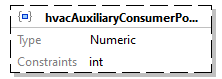</td>
				</tr>
				<tr>
					<td class="td-border" align="right" valign="top" style="width:10%;background-color:#F0F0F0;">property details</td>
					<td class="td-border" align="left" valign="top" style="width:90%;background-color:#F0F0F0;"><table class="table-no-border" cellspacing="0" cellpadding="0"><tr><td align="right" valign="top" style="background-color:#F0F0F0;">Occurrence&nbsp;&nbsp;</td><td align="left" valign="top" style="background-color:#F0F0F0;">Optional</td></tr></table></td>
				</tr>
				<tr>
					<td class="td-border" align="right" valign="top" style="width:10%;background-color:#F0F0F0;">type</td>
					<td class="td-border" align="left" valign="top" style="width:90%;background-color:#F0F0F0;">Numeric</td>
				</tr>
				<tr>
					<td class="td-border" align="right" valign="top" style="width:10%;background-color:#F0F0F0;">numeric constraints</td>
					<td class="td-border" align="left" valign="top" style="width:90%;background-color:#F0F0F0;"><table class="table-no-border" cellspacing="0" cellpadding="0"><tr><td align="right" valign="top" style="background-color:#F0F0F0;">Mode&nbsp;&nbsp;</td><td align="left" valign="top" style="background-color:#F0F0F0;">Integer</td></tr></table></td>
				</tr>
				<tr>
					<td class="td-border" align="right" valign="top" style="width:10%;background-color:#F0F0F0;">source code</td>
					<td class="td-border" align="left" valign="top" style="width:90%;background-color:#F0F0F0;">&quot;hvacAuxiliaryConsumerPower&quot;: { 
&nbsp;&nbsp;&nbsp; &quot;type&quot;: &quot;integer&quot;, 
&nbsp;&nbsp;&nbsp; &quot;additionalProperties&quot;: false 
}</td>
				</tr>
			</table>
			 
			
			Property
			<a href="#Link8">
				ManualPreconditioning
			</a>
			 / 
			systemPreconditioningStartTime
			<table class="table-border" width="100%" cellspacing="0" cellpadding="5" border="1">
				<tr>
					<td class="td-border" align="right" valign="top" style="width:10%;background-color:#F0F0F0;">diagram</td>
					<td class="td-border" align="left" valign="top" style="width:90%;background-color:#FFFFFF;"></td>
				</tr>
				<tr>
					<td class="td-border" align="right" valign="top" style="width:10%;background-color:#F0F0F0;">property details</td>
					<td class="td-border" align="left" valign="top" style="width:90%;background-color:#F0F0F0;"><table class="table-no-border" cellspacing="0" cellpadding="0"><tr><td align="right" valign="top" style="background-color:#F0F0F0;">Occurrence&nbsp;&nbsp;</td><td align="left" valign="top" style="background-color:#F0F0F0;">Required</td></tr></table></td>
				</tr>
				<tr>
					<td class="td-border" align="right" valign="top" style="width:10%;background-color:#F0F0F0;">type</td>
					<td class="td-border" align="left" valign="top" style="width:90%;background-color:#F0F0F0;">String</td>
				</tr>
				<tr>
					<td class="td-border" align="right" valign="top" style="width:10%;background-color:#F0F0F0;">string constraints</td>
					<td class="td-border" align="left" valign="top" style="width:90%;background-color:#F0F0F0;"><table class="table-no-border" cellspacing="0" cellpadding="0"><tr><td align="right" valign="top" style="background-color:#F0F0F0;">Format&nbsp;&nbsp;</td><td align="left" valign="top" style="background-color:#F0F0F0;">date-time</td></tr></table></td>
				</tr>
				<tr>
					<td class="td-border" align="right" valign="top" style="width:10%;background-color:#F0F0F0;">source code</td>
					<td class="td-border" align="left" valign="top" style="width:90%;background-color:#F0F0F0;">&quot;systemPreconditioningStartTime&quot;: { 
&nbsp;&nbsp;&nbsp; &quot;type&quot;: &quot;string&quot;, 
&nbsp;&nbsp;&nbsp; &quot;format&quot;: &quot;date-time&quot;, 
&nbsp;&nbsp;&nbsp; &quot;additionalProperties&quot;: false 
}</td>
				</tr>
			</table>
			 
			
			Property
			<a href="#Link8">
				ManualPreconditioning
			</a>
			 / 
			systemAuxiliaryConsumerPower
			<table class="table-border" width="100%" cellspacing="0" cellpadding="5" border="1">
				<tr>
					<td class="td-border" align="right" valign="top" style="width:10%;background-color:#F0F0F0;">diagram</td>
					<td class="td-border" align="left" valign="top" style="width:90%;background-color:#FFFFFF;">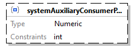</td>
				</tr>
				<tr>
					<td class="td-border" align="right" valign="top" style="width:10%;background-color:#F0F0F0;">property details</td>
					<td class="td-border" align="left" valign="top" style="width:90%;background-color:#F0F0F0;"><table class="table-no-border" cellspacing="0" cellpadding="0"><tr><td align="right" valign="top" style="background-color:#F0F0F0;">Occurrence&nbsp;&nbsp;</td><td align="left" valign="top" style="background-color:#F0F0F0;">Optional</td></tr></table></td>
				</tr>
				<tr>
					<td class="td-border" align="right" valign="top" style="width:10%;background-color:#F0F0F0;">type</td>
					<td class="td-border" align="left" valign="top" style="width:90%;background-color:#F0F0F0;">Numeric</td>
				</tr>
				<tr>
					<td class="td-border" align="right" valign="top" style="width:10%;background-color:#F0F0F0;">numeric constraints</td>
					<td class="td-border" align="left" valign="top" style="width:90%;background-color:#F0F0F0;"><table class="table-no-border" cellspacing="0" cellpadding="0"><tr><td align="right" valign="top" style="background-color:#F0F0F0;">Mode&nbsp;&nbsp;</td><td align="left" valign="top" style="background-color:#F0F0F0;">Integer</td></tr></table></td>
				</tr>
				<tr>
					<td class="td-border" align="right" valign="top" style="width:10%;background-color:#F0F0F0;">source code</td>
					<td class="td-border" align="left" valign="top" style="width:90%;background-color:#F0F0F0;">&quot;systemAuxiliaryConsumerPower&quot;: { 
&nbsp;&nbsp;&nbsp; &quot;type&quot;: &quot;integer&quot;, 
&nbsp;&nbsp;&nbsp; &quot;additionalProperties&quot;: false 
}</td>
				</tr>
			</table>
			 
			
			Schema definition
			ChargingRequest
			<table class="table-border" width="100%" cellspacing="0" cellpadding="5" border="1">
				<tr>
					<td class="td-border" align="right" valign="top" style="width:10%;background-color:#F0F0F0;">diagram</td>
					<td class="td-border" align="left" valign="top" style="width:90%;background-color:#FFFFFF;"><map id="Map7" name="Map7"><area alt="" coords="209,40,339,138" href="#Link10" /><area alt="" coords="209,150,335,259" href="#LinkF" /><area alt="" coords="209,271,356,369" href="#Link11" /><area alt="" coords="209,381,352,479" href="#Link12" /><area alt="" coords="209,491,343,559" href="#Link26" /><area alt="" coords="209,571,411,661" href="#Link14" /><area alt="" coords="209,673,376,742" href="#Link1B" /><area alt="" coords="209,754,400,852" href="#Link20" /><area alt="" coords="209,864,384,962" href="#Link25" /></map></td>
				</tr>
				<tr>
					<td class="td-border" align="right" valign="top" style="width:10%;background-color:#F0F0F0;">schema details</td>
					<td class="td-border" align="left" valign="top" style="width:90%;background-color:#F0F0F0;"><table class="table-no-border" cellspacing="0" cellpadding="0"><tr><td align="right" valign="top" style="background-color:#F0F0F0;">Description&nbsp;&nbsp;</td><td align="left" valign="top" style="background-color:#F0F0F0;">This type represents a charging request.</td></tr></table></td>
				</tr>
				<tr>
					<td class="td-border" align="right" valign="top" style="width:10%;background-color:#F0F0F0;">type</td>
					<td class="td-border" align="left" valign="top" style="width:90%;background-color:#F0F0F0;">Object</td>
				</tr>
				<tr>
					<td class="td-border" align="right" valign="top" style="width:10%;background-color:#F0F0F0;">properties</td>
					<td class="td-border" align="left" valign="top" style="width:90%;background-color:#F0F0F0;"><table class="table-no-border" cellspacing="0" cellpadding="0"><tr><td align="left" valign="top" style="background-color:#F0F0F0;">Name&nbsp;&nbsp;&nbsp;</td><td align="left" valign="top" style="background-color:#F0F0F0;">Occurrence</td></tr><tr><td align="left" valign="top" style="background-color:#F0F0F0;"><a href="#Link10">chargingPointId</a>&nbsp;&nbsp;&nbsp;</td><td align="left" valign="top" style="background-color:#F0F0F0;">Optional</td></tr><tr><td align="left" valign="top" style="background-color:#F0F0F0;"><a href="#LinkF">vehicleId</a>&nbsp;&nbsp;&nbsp;</td><td align="left" valign="top" style="background-color:#F0F0F0;">Required</td></tr><tr><td align="left" valign="top" style="background-color:#F0F0F0;"><a href="#Link11">chargingRequestId</a>&nbsp;&nbsp;&nbsp;</td><td align="left" valign="top" style="background-color:#F0F0F0;">Required</td></tr><tr><td align="left" valign="top" style="background-color:#F0F0F0;"><a href="#Link12">chargingProcessId</a>&nbsp;&nbsp;&nbsp;</td><td align="left" valign="top" style="background-color:#F0F0F0;">Optional</td></tr><tr><td align="left" valign="top" style="background-color:#F0F0F0;"><a href="#Link26">priority</a>&nbsp;&nbsp;&nbsp;</td><td align="left" valign="top" style="background-color:#F0F0F0;">Optional</td></tr><tr><td align="left" valign="top" style="background-color:#F0F0F0;"><a href="#Link14">chargingInstruction</a>&nbsp;&nbsp;&nbsp;</td><td align="left" valign="top" style="background-color:#F0F0F0;">Optional</td></tr><tr><td align="left" valign="top" style="background-color:#F0F0F0;"><a href="#Link1B">chargingRequestData</a>&nbsp;&nbsp;&nbsp;</td><td align="left" valign="top" style="background-color:#F0F0F0;">Required</td></tr><tr><td align="left" valign="top" style="background-color:#F0F0F0;"><a href="#Link20">automaticPreconditioning</a>&nbsp;&nbsp;&nbsp;</td><td align="left" valign="top" style="background-color:#F0F0F0;">Optional</td></tr><tr><td align="left" valign="top" style="background-color:#F0F0F0;"><a href="#Link25">manualPreconditioning</a>&nbsp;&nbsp;&nbsp;</td><td align="left" valign="top" style="background-color:#F0F0F0;">Optional</td></tr></table></td>
				</tr>
				<tr>
					<td class="td-border" align="right" valign="top" style="width:10%;background-color:#F0F0F0;">used by</td>
					<td class="td-border" align="left" valign="top" style="width:90%;background-color:#F0F0F0;">ProvideChargingInformationRequest.json / <a href="#LinkD">chargingRequestList</a> </td>
				</tr>
				<tr>
					<td class="td-border" align="right" valign="top" style="width:10%;background-color:#F0F0F0;">source code</td>
					<td class="td-border" align="left" valign="top" style="width:90%;background-color:#F0F0F0;">&quot;ChargingRequest&quot;: { 
&nbsp;&nbsp;&nbsp; &quot;description&quot;: &quot;This type represents a charging request.&quot;, 
&nbsp;&nbsp;&nbsp; &quot;type&quot;: &quot;object&quot;, 
&nbsp;&nbsp;&nbsp; &quot;properties&quot;: { 
&nbsp;&nbsp;&nbsp;&nbsp;&nbsp;&nbsp;&nbsp; &quot;chargingPointId&quot;: { 
&nbsp;&nbsp;&nbsp;&nbsp;&nbsp;&nbsp;&nbsp;&nbsp;&nbsp;&nbsp;&nbsp; &quot;$ref&quot;: &quot;#/definitions/UniqueIdentifier&quot; 
&nbsp;&nbsp;&nbsp;&nbsp;&nbsp;&nbsp;&nbsp; }, 
&nbsp;&nbsp;&nbsp;&nbsp;&nbsp;&nbsp;&nbsp; &quot;vehicleId&quot;: { 
&nbsp;&nbsp;&nbsp;&nbsp;&nbsp;&nbsp;&nbsp;&nbsp;&nbsp;&nbsp;&nbsp; &quot;$ref&quot;: &quot;#/definitions/VehicleIdentifier&quot; 
&nbsp;&nbsp;&nbsp;&nbsp;&nbsp;&nbsp;&nbsp; }, 
&nbsp;&nbsp;&nbsp;&nbsp;&nbsp;&nbsp;&nbsp; &quot;chargingRequestId&quot;: { 
&nbsp;&nbsp;&nbsp;&nbsp;&nbsp;&nbsp;&nbsp;&nbsp;&nbsp;&nbsp;&nbsp; &quot;$ref&quot;: &quot;#/definitions/UniqueIdentifier&quot; 
&nbsp;&nbsp;&nbsp;&nbsp;&nbsp;&nbsp;&nbsp; }, 
&nbsp;&nbsp;&nbsp;&nbsp;&nbsp;&nbsp;&nbsp; &quot;chargingProcessId&quot;: { 
&nbsp;&nbsp;&nbsp;&nbsp;&nbsp;&nbsp;&nbsp;&nbsp;&nbsp;&nbsp;&nbsp; &quot;$ref&quot;: &quot;#/definitions/UniqueIdentifier&quot; 
&nbsp;&nbsp;&nbsp;&nbsp;&nbsp;&nbsp;&nbsp; }, 
&nbsp;&nbsp;&nbsp;&nbsp;&nbsp;&nbsp;&nbsp; &quot;priority&quot;: { 
&nbsp;&nbsp;&nbsp;&nbsp;&nbsp;&nbsp;&nbsp;&nbsp;&nbsp;&nbsp;&nbsp; &quot;type&quot;: &quot;integer&quot;, 
&nbsp;&nbsp;&nbsp;&nbsp;&nbsp;&nbsp;&nbsp;&nbsp;&nbsp;&nbsp;&nbsp; &quot;additionalProperties&quot;: false 
&nbsp;&nbsp;&nbsp;&nbsp;&nbsp;&nbsp;&nbsp; }, 
&nbsp;&nbsp;&nbsp;&nbsp;&nbsp;&nbsp;&nbsp; &quot;chargingInstruction&quot;: { 
&nbsp;&nbsp;&nbsp;&nbsp;&nbsp;&nbsp;&nbsp;&nbsp;&nbsp;&nbsp;&nbsp; &quot;$ref&quot;: &quot;#/definitions/ChargingInstruction&quot; 
&nbsp;&nbsp;&nbsp;&nbsp;&nbsp;&nbsp;&nbsp; }, 
&nbsp;&nbsp;&nbsp;&nbsp;&nbsp;&nbsp;&nbsp; &quot;chargingRequestData&quot;: { 
&nbsp;&nbsp;&nbsp;&nbsp;&nbsp;&nbsp;&nbsp;&nbsp;&nbsp;&nbsp;&nbsp; &quot;$ref&quot;: &quot;#/definitions/ChargingRequestData&quot; 
&nbsp;&nbsp;&nbsp;&nbsp;&nbsp;&nbsp;&nbsp; }, 
&nbsp;&nbsp;&nbsp;&nbsp;&nbsp;&nbsp;&nbsp; &quot;automaticPreconditioning&quot;: { 
&nbsp;&nbsp;&nbsp;&nbsp;&nbsp;&nbsp;&nbsp;&nbsp;&nbsp;&nbsp;&nbsp; &quot;$ref&quot;: &quot;#/definitions/AutomaticPreconditioning&quot; 
&nbsp;&nbsp;&nbsp;&nbsp;&nbsp;&nbsp;&nbsp; }, 
&nbsp;&nbsp;&nbsp;&nbsp;&nbsp;&nbsp;&nbsp; &quot;manualPreconditioning&quot;: { 
&nbsp;&nbsp;&nbsp;&nbsp;&nbsp;&nbsp;&nbsp;&nbsp;&nbsp;&nbsp;&nbsp; &quot;$ref&quot;: &quot;#/definitions/ManualPreconditioning&quot; 
&nbsp;&nbsp;&nbsp;&nbsp;&nbsp;&nbsp;&nbsp; } 
&nbsp;&nbsp;&nbsp; }, 
&nbsp;&nbsp;&nbsp; &quot;required&quot;: [ 
&nbsp;&nbsp;&nbsp;&nbsp;&nbsp;&nbsp;&nbsp; &quot;vehicleId&quot;, 
&nbsp;&nbsp;&nbsp;&nbsp;&nbsp;&nbsp;&nbsp; &quot;chargingRequestId&quot;, 
&nbsp;&nbsp;&nbsp;&nbsp;&nbsp;&nbsp;&nbsp; &quot;chargingRequestData&quot; 
&nbsp;&nbsp;&nbsp; ], 
&nbsp;&nbsp;&nbsp; &quot;additionalProperties&quot;: false 
}</td>
				</tr>
			</table>
			 
			
			Property
			<a href="#Link9">
				ChargingRequest
			</a>
			 / 
			chargingPointId
			<table class="table-border" width="100%" cellspacing="0" cellpadding="5" border="1">
				<tr>
					<td class="td-border" align="right" valign="top" style="width:10%;background-color:#F0F0F0;">diagram</td>
					<td class="td-border" align="left" valign="top" style="width:90%;background-color:#FFFFFF;"></td>
				</tr>
				<tr>
					<td class="td-border" align="right" valign="top" style="width:10%;background-color:#F0F0F0;">property details</td>
					<td class="td-border" align="left" valign="top" style="width:90%;background-color:#F0F0F0;"><table class="table-no-border" cellspacing="0" cellpadding="0"><tr><td align="right" valign="top" style="background-color:#F0F0F0;">Occurrence&nbsp;&nbsp;</td><td align="left" valign="top" style="background-color:#F0F0F0;">Optional</td></tr></table></td>
				</tr>
				<tr>
					<td class="td-border" align="right" valign="top" style="width:10%;background-color:#F0F0F0;">reference</td>
					<td class="td-border" align="left" valign="top" style="width:90%;background-color:#F0F0F0;"><a href="#Link3">UniqueIdentifier</a></td>
				</tr>
				<tr>
					<td class="td-border" align="right" valign="top" style="width:10%;background-color:#F0F0F0;">source code</td>
					<td class="td-border" align="left" valign="top" style="width:90%;background-color:#F0F0F0;">&quot;chargingPointId&quot;: { 
&nbsp;&nbsp;&nbsp; &quot;$ref&quot;: &quot;#/definitions/UniqueIdentifier&quot; 
}</td>
				</tr>
			</table>
			 
			
			Property
			<a href="#Link9">
				ChargingRequest
			</a>
			 / 
			vehicleId
			<table class="table-border" width="100%" cellspacing="0" cellpadding="5" border="1">
				<tr>
					<td class="td-border" align="right" valign="top" style="width:10%;background-color:#F0F0F0;">diagram</td>
					<td class="td-border" align="left" valign="top" style="width:90%;background-color:#FFFFFF;">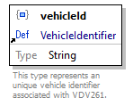</td>
				</tr>
				<tr>
					<td class="td-border" align="right" valign="top" style="width:10%;background-color:#F0F0F0;">property details</td>
					<td class="td-border" align="left" valign="top" style="width:90%;background-color:#F0F0F0;"><table class="table-no-border" cellspacing="0" cellpadding="0"><tr><td align="right" valign="top" style="background-color:#F0F0F0;">Occurrence&nbsp;&nbsp;</td><td align="left" valign="top" style="background-color:#F0F0F0;">Required</td></tr></table></td>
				</tr>
				<tr>
					<td class="td-border" align="right" valign="top" style="width:10%;background-color:#F0F0F0;">reference</td>
					<td class="td-border" align="left" valign="top" style="width:90%;background-color:#F0F0F0;"><a href="#Link2">VehicleIdentifier</a></td>
				</tr>
				<tr>
					<td class="td-border" align="right" valign="top" style="width:10%;background-color:#F0F0F0;">source code</td>
					<td class="td-border" align="left" valign="top" style="width:90%;background-color:#F0F0F0;">&quot;vehicleId&quot;: { 
&nbsp;&nbsp;&nbsp; &quot;$ref&quot;: &quot;#/definitions/VehicleIdentifier&quot; 
}</td>
				</tr>
			</table>
			 
			
			Property
			<a href="#Link9">
				ChargingRequest
			</a>
			 / 
			chargingRequestId
			<table class="table-border" width="100%" cellspacing="0" cellpadding="5" border="1">
				<tr>
					<td class="td-border" align="right" valign="top" style="width:10%;background-color:#F0F0F0;">diagram</td>
					<td class="td-border" align="left" valign="top" style="width:90%;background-color:#FFFFFF;">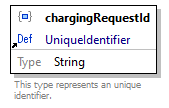</td>
				</tr>
				<tr>
					<td class="td-border" align="right" valign="top" style="width:10%;background-color:#F0F0F0;">property details</td>
					<td class="td-border" align="left" valign="top" style="width:90%;background-color:#F0F0F0;"><table class="table-no-border" cellspacing="0" cellpadding="0"><tr><td align="right" valign="top" style="background-color:#F0F0F0;">Occurrence&nbsp;&nbsp;</td><td align="left" valign="top" style="background-color:#F0F0F0;">Required</td></tr></table></td>
				</tr>
				<tr>
					<td class="td-border" align="right" valign="top" style="width:10%;background-color:#F0F0F0;">reference</td>
					<td class="td-border" align="left" valign="top" style="width:90%;background-color:#F0F0F0;"><a href="#Link3">UniqueIdentifier</a></td>
				</tr>
				<tr>
					<td class="td-border" align="right" valign="top" style="width:10%;background-color:#F0F0F0;">source code</td>
					<td class="td-border" align="left" valign="top" style="width:90%;background-color:#F0F0F0;">&quot;chargingRequestId&quot;: { 
&nbsp;&nbsp;&nbsp; &quot;$ref&quot;: &quot;#/definitions/UniqueIdentifier&quot; 
}</td>
				</tr>
			</table>
			 
			
			Property
			<a href="#Link9">
				ChargingRequest
			</a>
			 / 
			chargingProcessId
			<table class="table-border" width="100%" cellspacing="0" cellpadding="5" border="1">
				<tr>
					<td class="td-border" align="right" valign="top" style="width:10%;background-color:#F0F0F0;">diagram</td>
					<td class="td-border" align="left" valign="top" style="width:90%;background-color:#FFFFFF;">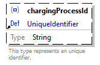</td>
				</tr>
				<tr>
					<td class="td-border" align="right" valign="top" style="width:10%;background-color:#F0F0F0;">property details</td>
					<td class="td-border" align="left" valign="top" style="width:90%;background-color:#F0F0F0;"><table class="table-no-border" cellspacing="0" cellpadding="0"><tr><td align="right" valign="top" style="background-color:#F0F0F0;">Occurrence&nbsp;&nbsp;</td><td align="left" valign="top" style="background-color:#F0F0F0;">Optional</td></tr></table></td>
				</tr>
				<tr>
					<td class="td-border" align="right" valign="top" style="width:10%;background-color:#F0F0F0;">reference</td>
					<td class="td-border" align="left" valign="top" style="width:90%;background-color:#F0F0F0;"><a href="#Link3">UniqueIdentifier</a></td>
				</tr>
				<tr>
					<td class="td-border" align="right" valign="top" style="width:10%;background-color:#F0F0F0;">source code</td>
					<td class="td-border" align="left" valign="top" style="width:90%;background-color:#F0F0F0;">&quot;chargingProcessId&quot;: { 
&nbsp;&nbsp;&nbsp; &quot;$ref&quot;: &quot;#/definitions/UniqueIdentifier&quot; 
}</td>
				</tr>
			</table>
			 
			
			Property
			<a href="#Link9">
				ChargingRequest
			</a>
			 / 
			priority
			<table class="table-border" width="100%" cellspacing="0" cellpadding="5" border="1">
				<tr>
					<td class="td-border" align="right" valign="top" style="width:10%;background-color:#F0F0F0;">diagram</td>
					<td class="td-border" align="left" valign="top" style="width:90%;background-color:#FFFFFF;">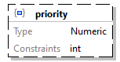</td>
				</tr>
				<tr>
					<td class="td-border" align="right" valign="top" style="width:10%;background-color:#F0F0F0;">property details</td>
					<td class="td-border" align="left" valign="top" style="width:90%;background-color:#F0F0F0;"><table class="table-no-border" cellspacing="0" cellpadding="0"><tr><td align="right" valign="top" style="background-color:#F0F0F0;">Occurrence&nbsp;&nbsp;</td><td align="left" valign="top" style="background-color:#F0F0F0;">Optional</td></tr></table></td>
				</tr>
				<tr>
					<td class="td-border" align="right" valign="top" style="width:10%;background-color:#F0F0F0;">type</td>
					<td class="td-border" align="left" valign="top" style="width:90%;background-color:#F0F0F0;">Numeric</td>
				</tr>
				<tr>
					<td class="td-border" align="right" valign="top" style="width:10%;background-color:#F0F0F0;">numeric constraints</td>
					<td class="td-border" align="left" valign="top" style="width:90%;background-color:#F0F0F0;"><table class="table-no-border" cellspacing="0" cellpadding="0"><tr><td align="right" valign="top" style="background-color:#F0F0F0;">Mode&nbsp;&nbsp;</td><td align="left" valign="top" style="background-color:#F0F0F0;">Integer</td></tr></table></td>
				</tr>
				<tr>
					<td class="td-border" align="right" valign="top" style="width:10%;background-color:#F0F0F0;">source code</td>
					<td class="td-border" align="left" valign="top" style="width:90%;background-color:#F0F0F0;">&quot;priority&quot;: { 
&nbsp;&nbsp;&nbsp; &quot;type&quot;: &quot;integer&quot;, 
&nbsp;&nbsp;&nbsp; &quot;additionalProperties&quot;: false 
}</td>
				</tr>
			</table>
			 
			
			Property
			<a href="#Link9">
				ChargingRequest
			</a>
			 / 
			chargingInstruction
			<table class="table-border" width="100%" cellspacing="0" cellpadding="5" border="1">
				<tr>
					<td class="td-border" align="right" valign="top" style="width:10%;background-color:#F0F0F0;">diagram</td>
					<td class="td-border" align="left" valign="top" style="width:90%;background-color:#FFFFFF;">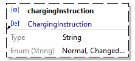</td>
				</tr>
				<tr>
					<td class="td-border" align="right" valign="top" style="width:10%;background-color:#F0F0F0;">property details</td>
					<td class="td-border" align="left" valign="top" style="width:90%;background-color:#F0F0F0;"><table class="table-no-border" cellspacing="0" cellpadding="0"><tr><td align="right" valign="top" style="background-color:#F0F0F0;">Occurrence&nbsp;&nbsp;</td><td align="left" valign="top" style="background-color:#F0F0F0;">Optional</td></tr></table></td>
				</tr>
				<tr>
					<td class="td-border" align="right" valign="top" style="width:10%;background-color:#F0F0F0;">reference</td>
					<td class="td-border" align="left" valign="top" style="width:90%;background-color:#F0F0F0;"><a href="#Link4">ChargingInstruction</a></td>
				</tr>
				<tr>
					<td class="td-border" align="right" valign="top" style="width:10%;background-color:#F0F0F0;">source code</td>
					<td class="td-border" align="left" valign="top" style="width:90%;background-color:#F0F0F0;">&quot;chargingInstruction&quot;: { 
&nbsp;&nbsp;&nbsp; &quot;$ref&quot;: &quot;#/definitions/ChargingInstruction&quot; 
}</td>
				</tr>
			</table>
			 
			
			Property
			<a href="#Link9">
				ChargingRequest
			</a>
			 / 
			chargingRequestData
			<table class="table-border" width="100%" cellspacing="0" cellpadding="5" border="1">
				<tr>
					<td class="td-border" align="right" valign="top" style="width:10%;background-color:#F0F0F0;">diagram</td>
					<td class="td-border" align="left" valign="top" style="width:90%;background-color:#FFFFFF;"></td>
				</tr>
				<tr>
					<td class="td-border" align="right" valign="top" style="width:10%;background-color:#F0F0F0;">property details</td>
					<td class="td-border" align="left" valign="top" style="width:90%;background-color:#F0F0F0;"><table class="table-no-border" cellspacing="0" cellpadding="0"><tr><td align="right" valign="top" style="background-color:#F0F0F0;">Occurrence&nbsp;&nbsp;</td><td align="left" valign="top" style="background-color:#F0F0F0;">Required</td></tr></table></td>
				</tr>
				<tr>
					<td class="td-border" align="right" valign="top" style="width:10%;background-color:#F0F0F0;">reference</td>
					<td class="td-border" align="left" valign="top" style="width:90%;background-color:#F0F0F0;"><a href="#Link5">ChargingRequestData</a></td>
				</tr>
				<tr>
					<td class="td-border" align="right" valign="top" style="width:10%;background-color:#F0F0F0;">source code</td>
					<td class="td-border" align="left" valign="top" style="width:90%;background-color:#F0F0F0;">&quot;chargingRequestData&quot;: { 
&nbsp;&nbsp;&nbsp; &quot;$ref&quot;: &quot;#/definitions/ChargingRequestData&quot; 
}</td>
				</tr>
			</table>
			 
			
			Property
			<a href="#Link9">
				ChargingRequest
			</a>
			 / 
			automaticPreconditioning
			<table class="table-border" width="100%" cellspacing="0" cellpadding="5" border="1">
				<tr>
					<td class="td-border" align="right" valign="top" style="width:10%;background-color:#F0F0F0;">diagram</td>
					<td class="td-border" align="left" valign="top" style="width:90%;background-color:#FFFFFF;"></td>
				</tr>
				<tr>
					<td class="td-border" align="right" valign="top" style="width:10%;background-color:#F0F0F0;">property details</td>
					<td class="td-border" align="left" valign="top" style="width:90%;background-color:#F0F0F0;"><table class="table-no-border" cellspacing="0" cellpadding="0"><tr><td align="right" valign="top" style="background-color:#F0F0F0;">Occurrence&nbsp;&nbsp;</td><td align="left" valign="top" style="background-color:#F0F0F0;">Optional</td></tr></table></td>
				</tr>
				<tr>
					<td class="td-border" align="right" valign="top" style="width:10%;background-color:#F0F0F0;">reference</td>
					<td class="td-border" align="left" valign="top" style="width:90%;background-color:#F0F0F0;"><a href="#Link7">AutomaticPreconditioning</a></td>
				</tr>
				<tr>
					<td class="td-border" align="right" valign="top" style="width:10%;background-color:#F0F0F0;">source code</td>
					<td class="td-border" align="left" valign="top" style="width:90%;background-color:#F0F0F0;">&quot;automaticPreconditioning&quot;: { 
&nbsp;&nbsp;&nbsp; &quot;$ref&quot;: &quot;#/definitions/AutomaticPreconditioning&quot; 
}</td>
				</tr>
			</table>
			 
			
			Property
			<a href="#Link9">
				ChargingRequest
			</a>
			 / 
			manualPreconditioning
			<table class="table-border" width="100%" cellspacing="0" cellpadding="5" border="1">
				<tr>
					<td class="td-border" align="right" valign="top" style="width:10%;background-color:#F0F0F0;">diagram</td>
					<td class="td-border" align="left" valign="top" style="width:90%;background-color:#FFFFFF;"></td>
				</tr>
				<tr>
					<td class="td-border" align="right" valign="top" style="width:10%;background-color:#F0F0F0;">property details</td>
					<td class="td-border" align="left" valign="top" style="width:90%;background-color:#F0F0F0;"><table class="table-no-border" cellspacing="0" cellpadding="0"><tr><td align="right" valign="top" style="background-color:#F0F0F0;">Occurrence&nbsp;&nbsp;</td><td align="left" valign="top" style="background-color:#F0F0F0;">Optional</td></tr></table></td>
				</tr>
				<tr>
					<td class="td-border" align="right" valign="top" style="width:10%;background-color:#F0F0F0;">reference</td>
					<td class="td-border" align="left" valign="top" style="width:90%;background-color:#F0F0F0;"><a href="#Link8">ManualPreconditioning</a></td>
				</tr>
				<tr>
					<td class="td-border" align="right" valign="top" style="width:10%;background-color:#F0F0F0;">source code</td>
					<td class="td-border" align="left" valign="top" style="width:90%;background-color:#F0F0F0;">&quot;manualPreconditioning&quot;: { 
&nbsp;&nbsp;&nbsp; &quot;$ref&quot;: &quot;#/definitions/ManualPreconditioning&quot; 
}</td>
				</tr>
			</table>
			 
			
			Schema definition
			MaintenanceRequest
			<table class="table-border" width="100%" cellspacing="0" cellpadding="5" border="1">
				<tr>
					<td class="td-border" align="right" valign="top" style="width:10%;background-color:#F0F0F0;">diagram</td>
					<td class="td-border" align="left" valign="top" style="width:90%;background-color:#FFFFFF;"><map id="Map8" name="Map8"><area alt="" coords="232,40,362,138" href="#Link13" /><area alt="" coords="232,150,412,218" href="#Link27" /><area alt="" coords="232,230,412,298" href="#Link28" /><area alt="" coords="232,310,434,400" href="#Link29" /><area alt="" coords="232,412,434,502" href="#Link2A" /></map></td>
				</tr>
				<tr>
					<td class="td-border" align="right" valign="top" style="width:10%;background-color:#F0F0F0;">schema details</td>
					<td class="td-border" align="left" valign="top" style="width:90%;background-color:#F0F0F0;"><table class="table-no-border" cellspacing="0" cellpadding="0"><tr><td align="right" valign="top" style="background-color:#F0F0F0;">Description&nbsp;&nbsp;</td><td align="left" valign="top" style="background-color:#F0F0F0;">This type represents a maintenance request used for planned maintenance at charging points.</td></tr></table></td>
				</tr>
				<tr>
					<td class="td-border" align="right" valign="top" style="width:10%;background-color:#F0F0F0;">type</td>
					<td class="td-border" align="left" valign="top" style="width:90%;background-color:#F0F0F0;">Object</td>
				</tr>
				<tr>
					<td class="td-border" align="right" valign="top" style="width:10%;background-color:#F0F0F0;">properties</td>
					<td class="td-border" align="left" valign="top" style="width:90%;background-color:#F0F0F0;"><table class="table-no-border" cellspacing="0" cellpadding="0"><tr><td align="left" valign="top" style="background-color:#F0F0F0;">Name&nbsp;&nbsp;&nbsp;</td><td align="left" valign="top" style="background-color:#F0F0F0;">Occurrence</td></tr><tr><td align="left" valign="top" style="background-color:#F0F0F0;"><a href="#Link13">chargingPointId</a>&nbsp;&nbsp;&nbsp;</td><td align="left" valign="top" style="background-color:#F0F0F0;">Required</td></tr><tr><td align="left" valign="top" style="background-color:#F0F0F0;"><a href="#Link27">startTime</a>&nbsp;&nbsp;&nbsp;</td><td align="left" valign="top" style="background-color:#F0F0F0;">Required</td></tr><tr><td align="left" valign="top" style="background-color:#F0F0F0;"><a href="#Link28">endTime</a>&nbsp;&nbsp;&nbsp;</td><td align="left" valign="top" style="background-color:#F0F0F0;">Optional</td></tr><tr><td align="left" valign="top" style="background-color:#F0F0F0;"><a href="#Link29">chargingMode</a>&nbsp;&nbsp;&nbsp;</td><td align="left" valign="top" style="background-color:#F0F0F0;">Required</td></tr><tr><td align="left" valign="top" style="background-color:#F0F0F0;"><a href="#Link2A">availability</a>&nbsp;&nbsp;&nbsp;</td><td align="left" valign="top" style="background-color:#F0F0F0;">Required</td></tr></table></td>
				</tr>
				<tr>
					<td class="td-border" align="right" valign="top" style="width:10%;background-color:#F0F0F0;">used by</td>
					<td class="td-border" align="left" valign="top" style="width:90%;background-color:#F0F0F0;">ProvideChargingInformationRequest.json / <a href="#LinkE">maintenanceRequestList</a> </td>
				</tr>
				<tr>
					<td class="td-border" align="right" valign="top" style="width:10%;background-color:#F0F0F0;">source code</td>
					<td class="td-border" align="left" valign="top" style="width:90%;background-color:#F0F0F0;">&quot;MaintenanceRequest&quot;: { 
&nbsp;&nbsp;&nbsp; &quot;description&quot;: &quot;This type represents a maintenance request used for planned maintenance at charging points.&quot;, 
&nbsp;&nbsp;&nbsp; &quot;type&quot;: &quot;object&quot;, 
&nbsp;&nbsp;&nbsp; &quot;properties&quot;: { 
&nbsp;&nbsp;&nbsp;&nbsp;&nbsp;&nbsp;&nbsp; &quot;chargingPointId&quot;: { 
&nbsp;&nbsp;&nbsp;&nbsp;&nbsp;&nbsp;&nbsp;&nbsp;&nbsp;&nbsp;&nbsp; &quot;$ref&quot;: &quot;#/definitions/UniqueIdentifier&quot; 
&nbsp;&nbsp;&nbsp;&nbsp;&nbsp;&nbsp;&nbsp; }, 
&nbsp;&nbsp;&nbsp;&nbsp;&nbsp;&nbsp;&nbsp; &quot;startTime&quot;: { 
&nbsp;&nbsp;&nbsp;&nbsp;&nbsp;&nbsp;&nbsp;&nbsp;&nbsp;&nbsp;&nbsp; &quot;type&quot;: &quot;string&quot;, 
&nbsp;&nbsp;&nbsp;&nbsp;&nbsp;&nbsp;&nbsp;&nbsp;&nbsp;&nbsp;&nbsp; &quot;format&quot;: &quot;date-time&quot;, 
&nbsp;&nbsp;&nbsp;&nbsp;&nbsp;&nbsp;&nbsp;&nbsp;&nbsp;&nbsp;&nbsp; &quot;additionalProperties&quot;: false 
&nbsp;&nbsp;&nbsp;&nbsp;&nbsp;&nbsp;&nbsp; }, 
&nbsp;&nbsp;&nbsp;&nbsp;&nbsp;&nbsp;&nbsp; &quot;endTime&quot;: { 
&nbsp;&nbsp;&nbsp;&nbsp;&nbsp;&nbsp;&nbsp;&nbsp;&nbsp;&nbsp;&nbsp; &quot;type&quot;: &quot;string&quot;, 
&nbsp;&nbsp;&nbsp;&nbsp;&nbsp;&nbsp;&nbsp;&nbsp;&nbsp;&nbsp;&nbsp; &quot;format&quot;: &quot;date-time&quot;, 
&nbsp;&nbsp;&nbsp;&nbsp;&nbsp;&nbsp;&nbsp;&nbsp;&nbsp;&nbsp;&nbsp; &quot;additionalProperties&quot;: false 
&nbsp;&nbsp;&nbsp;&nbsp;&nbsp;&nbsp;&nbsp; }, 
&nbsp;&nbsp;&nbsp;&nbsp;&nbsp;&nbsp;&nbsp; &quot;chargingMode&quot;: { 
&nbsp;&nbsp;&nbsp;&nbsp;&nbsp;&nbsp;&nbsp;&nbsp;&nbsp;&nbsp;&nbsp; &quot;$ref&quot;: &quot;#/definitions/MaintenanceChargingMode&quot; 
&nbsp;&nbsp;&nbsp;&nbsp;&nbsp;&nbsp;&nbsp; }, 
&nbsp;&nbsp;&nbsp;&nbsp;&nbsp;&nbsp;&nbsp; &quot;availability&quot;: { 
&nbsp;&nbsp;&nbsp;&nbsp;&nbsp;&nbsp;&nbsp;&nbsp;&nbsp;&nbsp;&nbsp; &quot;$ref&quot;: &quot;#/definitions/MaintenanceChargingAvailability&quot; 
&nbsp;&nbsp;&nbsp;&nbsp;&nbsp;&nbsp;&nbsp; } 
&nbsp;&nbsp;&nbsp; }, 
&nbsp;&nbsp;&nbsp; &quot;required&quot;: [ 
&nbsp;&nbsp;&nbsp;&nbsp;&nbsp;&nbsp;&nbsp; &quot;chargingPointId&quot;, 
&nbsp;&nbsp;&nbsp;&nbsp;&nbsp;&nbsp;&nbsp; &quot;startTime&quot;, 
&nbsp;&nbsp;&nbsp;&nbsp;&nbsp;&nbsp;&nbsp; &quot;chargingMode&quot;, 
&nbsp;&nbsp;&nbsp;&nbsp;&nbsp;&nbsp;&nbsp; &quot;availability&quot; 
&nbsp;&nbsp;&nbsp; ], 
&nbsp;&nbsp;&nbsp; &quot;additionalProperties&quot;: false 
}</td>
				</tr>
			</table>
			 
			
			Property
			<a href="#LinkA">
				MaintenanceRequest
			</a>
			 / 
			chargingPointId
			<table class="table-border" width="100%" cellspacing="0" cellpadding="5" border="1">
				<tr>
					<td class="td-border" align="right" valign="top" style="width:10%;background-color:#F0F0F0;">diagram</td>
					<td class="td-border" align="left" valign="top" style="width:90%;background-color:#FFFFFF;">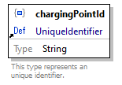</td>
				</tr>
				<tr>
					<td class="td-border" align="right" valign="top" style="width:10%;background-color:#F0F0F0;">property details</td>
					<td class="td-border" align="left" valign="top" style="width:90%;background-color:#F0F0F0;"><table class="table-no-border" cellspacing="0" cellpadding="0"><tr><td align="right" valign="top" style="background-color:#F0F0F0;">Occurrence&nbsp;&nbsp;</td><td align="left" valign="top" style="background-color:#F0F0F0;">Required</td></tr></table></td>
				</tr>
				<tr>
					<td class="td-border" align="right" valign="top" style="width:10%;background-color:#F0F0F0;">reference</td>
					<td class="td-border" align="left" valign="top" style="width:90%;background-color:#F0F0F0;"><a href="#Link3">UniqueIdentifier</a></td>
				</tr>
				<tr>
					<td class="td-border" align="right" valign="top" style="width:10%;background-color:#F0F0F0;">source code</td>
					<td class="td-border" align="left" valign="top" style="width:90%;background-color:#F0F0F0;">&quot;chargingPointId&quot;: { 
&nbsp;&nbsp;&nbsp; &quot;$ref&quot;: &quot;#/definitions/UniqueIdentifier&quot; 
}</td>
				</tr>
			</table>
			 
			
			Property
			<a href="#LinkA">
				MaintenanceRequest
			</a>
			 / 
			startTime
			<table class="table-border" width="100%" cellspacing="0" cellpadding="5" border="1">
				<tr>
					<td class="td-border" align="right" valign="top" style="width:10%;background-color:#F0F0F0;">diagram</td>
					<td class="td-border" align="left" valign="top" style="width:90%;background-color:#FFFFFF;"></td>
				</tr>
				<tr>
					<td class="td-border" align="right" valign="top" style="width:10%;background-color:#F0F0F0;">property details</td>
					<td class="td-border" align="left" valign="top" style="width:90%;background-color:#F0F0F0;"><table class="table-no-border" cellspacing="0" cellpadding="0"><tr><td align="right" valign="top" style="background-color:#F0F0F0;">Occurrence&nbsp;&nbsp;</td><td align="left" valign="top" style="background-color:#F0F0F0;">Required</td></tr></table></td>
				</tr>
				<tr>
					<td class="td-border" align="right" valign="top" style="width:10%;background-color:#F0F0F0;">type</td>
					<td class="td-border" align="left" valign="top" style="width:90%;background-color:#F0F0F0;">String</td>
				</tr>
				<tr>
					<td class="td-border" align="right" valign="top" style="width:10%;background-color:#F0F0F0;">string constraints</td>
					<td class="td-border" align="left" valign="top" style="width:90%;background-color:#F0F0F0;"><table class="table-no-border" cellspacing="0" cellpadding="0"><tr><td align="right" valign="top" style="background-color:#F0F0F0;">Format&nbsp;&nbsp;</td><td align="left" valign="top" style="background-color:#F0F0F0;">date-time</td></tr></table></td>
				</tr>
				<tr>
					<td class="td-border" align="right" valign="top" style="width:10%;background-color:#F0F0F0;">source code</td>
					<td class="td-border" align="left" valign="top" style="width:90%;background-color:#F0F0F0;">&quot;startTime&quot;: { 
&nbsp;&nbsp;&nbsp; &quot;type&quot;: &quot;string&quot;, 
&nbsp;&nbsp;&nbsp; &quot;format&quot;: &quot;date-time&quot;, 
&nbsp;&nbsp;&nbsp; &quot;additionalProperties&quot;: false 
}</td>
				</tr>
			</table>
			 
			
			Property
			<a href="#LinkA">
				MaintenanceRequest
			</a>
			 / 
			endTime
			<table class="table-border" width="100%" cellspacing="0" cellpadding="5" border="1">
				<tr>
					<td class="td-border" align="right" valign="top" style="width:10%;background-color:#F0F0F0;">diagram</td>
					<td class="td-border" align="left" valign="top" style="width:90%;background-color:#FFFFFF;"></td>
				</tr>
				<tr>
					<td class="td-border" align="right" valign="top" style="width:10%;background-color:#F0F0F0;">property details</td>
					<td class="td-border" align="left" valign="top" style="width:90%;background-color:#F0F0F0;"><table class="table-no-border" cellspacing="0" cellpadding="0"><tr><td align="right" valign="top" style="background-color:#F0F0F0;">Occurrence&nbsp;&nbsp;</td><td align="left" valign="top" style="background-color:#F0F0F0;">Optional</td></tr></table></td>
				</tr>
				<tr>
					<td class="td-border" align="right" valign="top" style="width:10%;background-color:#F0F0F0;">type</td>
					<td class="td-border" align="left" valign="top" style="width:90%;background-color:#F0F0F0;">String</td>
				</tr>
				<tr>
					<td class="td-border" align="right" valign="top" style="width:10%;background-color:#F0F0F0;">string constraints</td>
					<td class="td-border" align="left" valign="top" style="width:90%;background-color:#F0F0F0;"><table class="table-no-border" cellspacing="0" cellpadding="0"><tr><td align="right" valign="top" style="background-color:#F0F0F0;">Format&nbsp;&nbsp;</td><td align="left" valign="top" style="background-color:#F0F0F0;">date-time</td></tr></table></td>
				</tr>
				<tr>
					<td class="td-border" align="right" valign="top" style="width:10%;background-color:#F0F0F0;">source code</td>
					<td class="td-border" align="left" valign="top" style="width:90%;background-color:#F0F0F0;">&quot;endTime&quot;: { 
&nbsp;&nbsp;&nbsp; &quot;type&quot;: &quot;string&quot;, 
&nbsp;&nbsp;&nbsp; &quot;format&quot;: &quot;date-time&quot;, 
&nbsp;&nbsp;&nbsp; &quot;additionalProperties&quot;: false 
}</td>
				</tr>
			</table>
			 
			
			Property
			<a href="#LinkA">
				MaintenanceRequest
			</a>
			 / 
			chargingMode
			<table class="table-border" width="100%" cellspacing="0" cellpadding="5" border="1">
				<tr>
					<td class="td-border" align="right" valign="top" style="width:10%;background-color:#F0F0F0;">diagram</td>
					<td class="td-border" align="left" valign="top" style="width:90%;background-color:#FFFFFF;">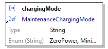</td>
				</tr>
				<tr>
					<td class="td-border" align="right" valign="top" style="width:10%;background-color:#F0F0F0;">property details</td>
					<td class="td-border" align="left" valign="top" style="width:90%;background-color:#F0F0F0;"><table class="table-no-border" cellspacing="0" cellpadding="0"><tr><td align="right" valign="top" style="background-color:#F0F0F0;">Occurrence&nbsp;&nbsp;</td><td align="left" valign="top" style="background-color:#F0F0F0;">Required</td></tr></table></td>
				</tr>
				<tr>
					<td class="td-border" align="right" valign="top" style="width:10%;background-color:#F0F0F0;">reference</td>
					<td class="td-border" align="left" valign="top" style="width:90%;background-color:#F0F0F0;"><a href="#LinkB">MaintenanceChargingMode</a></td>
				</tr>
				<tr>
					<td class="td-border" align="right" valign="top" style="width:10%;background-color:#F0F0F0;">source code</td>
					<td class="td-border" align="left" valign="top" style="width:90%;background-color:#F0F0F0;">&quot;chargingMode&quot;: { 
&nbsp;&nbsp;&nbsp; &quot;$ref&quot;: &quot;#/definitions/MaintenanceChargingMode&quot; 
}</td>
				</tr>
			</table>
			 
			
			Property
			<a href="#LinkA">
				MaintenanceRequest
			</a>
			 / 
			availability
			<table class="table-border" width="100%" cellspacing="0" cellpadding="5" border="1">
				<tr>
					<td class="td-border" align="right" valign="top" style="width:10%;background-color:#F0F0F0;">diagram</td>
					<td class="td-border" align="left" valign="top" style="width:90%;background-color:#FFFFFF;"></td>
				</tr>
				<tr>
					<td class="td-border" align="right" valign="top" style="width:10%;background-color:#F0F0F0;">property details</td>
					<td class="td-border" align="left" valign="top" style="width:90%;background-color:#F0F0F0;"><table class="table-no-border" cellspacing="0" cellpadding="0"><tr><td align="right" valign="top" style="background-color:#F0F0F0;">Occurrence&nbsp;&nbsp;</td><td align="left" valign="top" style="background-color:#F0F0F0;">Required</td></tr></table></td>
				</tr>
				<tr>
					<td class="td-border" align="right" valign="top" style="width:10%;background-color:#F0F0F0;">reference</td>
					<td class="td-border" align="left" valign="top" style="width:90%;background-color:#F0F0F0;"><a href="#LinkC">MaintenanceChargingAvailability</a></td>
				</tr>
				<tr>
					<td class="td-border" align="right" valign="top" style="width:10%;background-color:#F0F0F0;">source code</td>
					<td class="td-border" align="left" valign="top" style="width:90%;background-color:#F0F0F0;">&quot;availability&quot;: { 
&nbsp;&nbsp;&nbsp; &quot;$ref&quot;: &quot;#/definitions/MaintenanceChargingAvailability&quot; 
}</td>
				</tr>
			</table>
			 
			
			Schema definition
			MaintenanceChargingMode
			<table class="table-border" width="100%" cellspacing="0" cellpadding="5" border="1">
				<tr>
					<td class="td-border" align="right" valign="top" style="width:10%;background-color:#F0F0F0;">diagram</td>
					<td class="td-border" align="left" valign="top" style="width:90%;background-color:#FFFFFF;">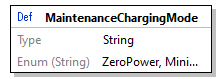</td>
				</tr>
				<tr>
					<td class="td-border" align="right" valign="top" style="width:10%;background-color:#F0F0F0;">type</td>
					<td class="td-border" align="left" valign="top" style="width:90%;background-color:#F0F0F0;">String</td>
				</tr>
				<tr>
					<td class="td-border" align="right" valign="top" style="width:10%;background-color:#F0F0F0;">enumerations</td>
					<td class="td-border" align="left" valign="top" style="width:90%;background-color:#F0F0F0;"><table class="table-no-border" cellspacing="0" cellpadding="0"><tr><td align="left" valign="top" style="background-color:#F0F0F0;">Type&nbsp;&nbsp;&nbsp;</td><td align="left" valign="top" style="background-color:#F0F0F0;">Value</td></tr><tr><td align="left" valign="top" style="background-color:#F0F0F0;">string&nbsp;&nbsp;&nbsp;</td><td align="left" valign="top" style="background-color:#F0F0F0;">ZeroPower</td></tr><tr><td align="left" valign="top" style="background-color:#F0F0F0;">string&nbsp;&nbsp;&nbsp;</td><td align="left" valign="top" style="background-color:#F0F0F0;">MinimumPower</td></tr></table></td>
				</tr>
				<tr>
					<td class="td-border" align="right" valign="top" style="width:10%;background-color:#F0F0F0;">used by</td>
					<td class="td-border" align="left" valign="top" style="width:90%;background-color:#F0F0F0;">MaintenanceRequest / <a href="#Link29">chargingMode</a> </td>
				</tr>
				<tr>
					<td class="td-border" align="right" valign="top" style="width:10%;background-color:#F0F0F0;">source code</td>
					<td class="td-border" align="left" valign="top" style="width:90%;background-color:#F0F0F0;">&quot;MaintenanceChargingMode&quot;: { 
&nbsp;&nbsp;&nbsp; &quot;type&quot;: &quot;string&quot;, 
&nbsp;&nbsp;&nbsp; &quot;additionalProperties&quot;: false, 
&nbsp;&nbsp;&nbsp; &quot;enum&quot;: [ 
&nbsp;&nbsp;&nbsp;&nbsp;&nbsp;&nbsp;&nbsp; &quot;ZeroPower&quot;, 
&nbsp;&nbsp;&nbsp;&nbsp;&nbsp;&nbsp;&nbsp; &quot;MinimumPower&quot; 
&nbsp;&nbsp;&nbsp; ] 
}</td>
				</tr>
			</table>
			 
			
			Schema definition
			MaintenanceChargingAvailability
			<table class="table-border" width="100%" cellspacing="0" cellpadding="5" border="1">
				<tr>
					<td class="td-border" align="right" valign="top" style="width:10%;background-color:#F0F0F0;">diagram</td>
					<td class="td-border" align="left" valign="top" style="width:90%;background-color:#FFFFFF;"></td>
				</tr>
				<tr>
					<td class="td-border" align="right" valign="top" style="width:10%;background-color:#F0F0F0;">type</td>
					<td class="td-border" align="left" valign="top" style="width:90%;background-color:#F0F0F0;">String</td>
				</tr>
				<tr>
					<td class="td-border" align="right" valign="top" style="width:10%;background-color:#F0F0F0;">enumerations</td>
					<td class="td-border" align="left" valign="top" style="width:90%;background-color:#F0F0F0;"><table class="table-no-border" cellspacing="0" cellpadding="0"><tr><td align="left" valign="top" style="background-color:#F0F0F0;">Type&nbsp;&nbsp;&nbsp;</td><td align="left" valign="top" style="background-color:#F0F0F0;">Value</td></tr><tr><td align="left" valign="top" style="background-color:#F0F0F0;">string&nbsp;&nbsp;&nbsp;</td><td align="left" valign="top" style="background-color:#F0F0F0;">Available</td></tr><tr><td align="left" valign="top" style="background-color:#F0F0F0;">string&nbsp;&nbsp;&nbsp;</td><td align="left" valign="top" style="background-color:#F0F0F0;">Unavailable</td></tr></table></td>
				</tr>
				<tr>
					<td class="td-border" align="right" valign="top" style="width:10%;background-color:#F0F0F0;">used by</td>
					<td class="td-border" align="left" valign="top" style="width:90%;background-color:#F0F0F0;">MaintenanceRequest / <a href="#Link2A">availability</a> </td>
				</tr>
				<tr>
					<td class="td-border" align="right" valign="top" style="width:10%;background-color:#F0F0F0;">source code</td>
					<td class="td-border" align="left" valign="top" style="width:90%;background-color:#F0F0F0;">&quot;MaintenanceChargingAvailability&quot;: { 
&nbsp;&nbsp;&nbsp; &quot;type&quot;: &quot;string&quot;, 
&nbsp;&nbsp;&nbsp; &quot;additionalProperties&quot;: false, 
&nbsp;&nbsp;&nbsp; &quot;enum&quot;: [ 
&nbsp;&nbsp;&nbsp;&nbsp;&nbsp;&nbsp;&nbsp; &quot;Available&quot;, 
&nbsp;&nbsp;&nbsp;&nbsp;&nbsp;&nbsp;&nbsp; &quot;Unavailable&quot; 
&nbsp;&nbsp;&nbsp; ] 
}</td>
				</tr>
			</table>
			 
			 
			JSON Schema documentation generated by 
			<a href="http://www.altova.com/xmlspy">
				XMLSpy
			</a>
			 JSON Schema Editor 
			<a href="http://www.altova.com/xmlspy/json-schema-editor.html">
				http://www.altova.com/xmlspy/json-schema-editor.html
			</a>
		

	</body>
</html>
